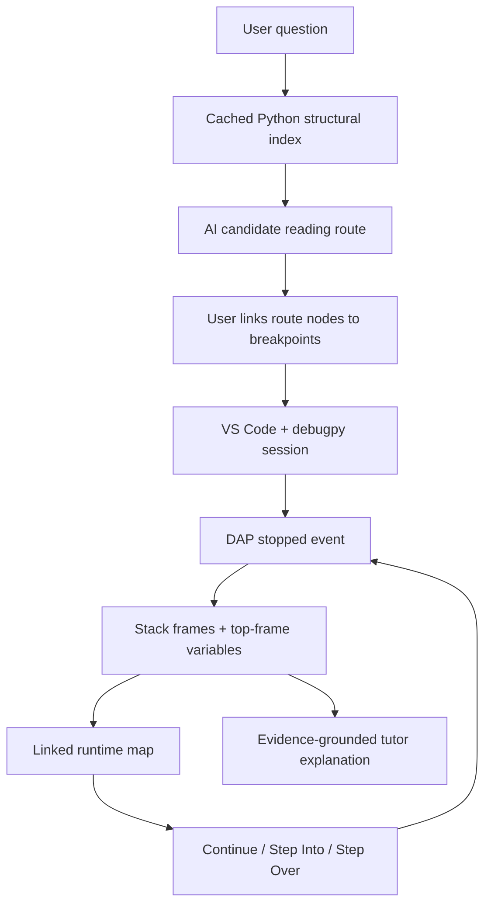

# Code Cat MVP architecture

## Product boundary

The first product is a Python-only VS Code extension. Its job is to help a developer answer one question about an unfamiliar codebase through a sequence of planned reading stops and real debugger pauses.

It is not a general code-generation agent and it does not own the debugger. It composes VS Code, the installed Python extension, debugpy, the Language Model API, and a linked visualization.

The shared composer supports two project-aware outcomes. Normal conversation remains in the
overview as a lightweight chat history; questions about where or how code executes produce a
validated route. Both outcomes share recent conversation context, while route nodes still must
resolve to files in the open Python workspace. Without an open workspace, the composer presents
an explicit project-opening action and does not call the model.

## Core flow

The candidate route and actual execution history remain separate concepts. A route says *where the behavior probably lives*. A pause says *what really executed for this input*.

## Four requested capabilities

### 1. Fast project understanding and question-to-chain location

Use a progressive retrieval pipeline rather than sending the whole repository to a model:

1. Maintain a cheap invalidated index of Python paths and declarations.
2. Rank file names and symbols against model-generated search terms.
3. Resolve definitions, references, and outgoing calls through VS Code's language features when available.
4. Read only bounded snippets around the best symbols.
5. Ask the model to assemble a 3–8 node route and include confidence.
6. Replace inferred edges with runtime evidence as debugging proceeds.

The prototype implements steps 1 and 5, with path validation before any route node becomes interactive. Language-server retrieval and the second evidence pass are the next deepening step.

### 2. Breakpoints merged with conversational teaching

The breakpoint is part of the lesson plan, not just a red dot:

- Every route node owns a source location and breakpoint state.
- The learner chooses which proposed stops become real breakpoints.
- Model-proposed function declarations are refined to a nearby executable statement, and the
  editor shows route context plus precise CodeLens controls at that line.
- Code Cat tracks ownership of the breakpoints it creates. Guided-debug termination, route
  replacement, explicit new-conversation actions, and idle-view closure remove only those
  managed breakpoints. Debug termination cleanup is scoped to the session Code Cat is actually
  observing, so an unrelated parallel debug session cannot clear the teaching route.
- A debug pause becomes a durable `DebugPause` snapshot.
- The tutor sees the learning question, stop reason, stack, and bounded variables.
- Continue, Step Into, and Step Over are available beside the explanation.

This keeps the learner in control and makes every explanation attributable to a real runtime observation.

### 3. Clear call-stack logic

Each pause stores the stack in debugger order. Both a native tree view and the runtime webview show frames. Selecting a frame opens the source and highlights it as the selected teaching context.

The current implementation captures variables only for frame zero. A later version should lazily request scopes when the learner selects a deeper frame instead of eagerly expanding every frame.

### 4. Mind map linked to breakpoints and the stack

The map uses a small, purposeful vocabulary:

- **Route node** — a likely teaching stop proposed from static evidence.
- **Breakpoint marker** — whether a route node is linked to a VS Code source breakpoint.
- **Active route node** — a route file currently present in the real call stack.
- **Pause chip** — one observed runtime stop in chronological order.
- **Frame row** — one actual frame belonging to the selected pause.

Clicking any route node or frame reveals source. Clicking a breakpoint marker changes VS Code's breakpoint collection. Selecting a historical pause redraws its stack and variables. This provides mind-map behavior without showing an unreadable full-repository graph.

Candidate route nodes use a dashed border, nodes seen in a captured stack use a solid border, and nodes in the selected pause receive the active highlight. This prevents a static guess from looking like runtime proof.

## Module boundaries

| Module | Responsibility |
| --- | --- |
| `PythonProjectIndex` | Cheap, cached Python file and declaration inventory |
| `AiTutor` | Route-planning and pause-explanation prompts, parsing, path validation |
| `DebugSessionObserver` | Observe debugpy/Python DAP events and capture bounded snapshots |
| `SessionStore` | Single in-memory source of truth for route, pauses, selection, and tutor state |
| `RuntimeMapView` | Linked route, breakpoints, runtime trace, frames, variables, and controls |
| `CallStackTree` | Native VS Code stack navigation |

## Next implementation slices

1. Add a language-feature adapter for document symbols, definitions, references, and call hierarchy.
2. Make route planning two-stage: seed selection, then evidence-grounded route assembly.
3. Lazy-load variables for the selected stack frame.
4. Persist a `CodeReadingSession` with question, debug configuration, route, pauses, and notes.
5. Add explicit route corrections when actual runtime evidence contradicts the candidate route.
6. Add evaluation fixtures for path precision, stack capture, and unsafe/unresolvable model output.
