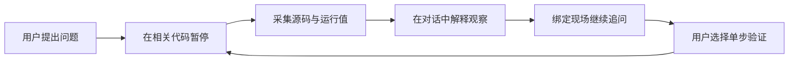

# Stage 01：围绕暂停证据连续理解代码

状态：已实现并验证。本地设计与实现记录，未发布外部 issue。

## 目标与范围

将对话作为主入口，暂停成为对话中的观察。普通追问绑定选定快照，解释引用相关源码、顶层变量与调用来源，区分观察事实、源码推断和未知。保留路径与原始证据作为渐进展开的辅助视图。回复期间可编辑草稿、停止生成；历史快照不能执行调试控制。

不包含自动调试代理、跨进程追踪或自动选择所有断点。复用 VS Code 主题与现有 Python/debugpy 链路。

## 验收

- 真实暂停后连续提问，模型获得对应快照与相关源码，回答不替换阅读路径或断点。
- 暂停解释保留在聊天历史中，迟到回答标明原观察，不冒充新暂停。
- 对话内可展开源码、变量、调用来源，不切换页签也能提问和单步。
- 等待回复时可编辑草稿；停止或失败保留现场并可重试。
- 运行中、历史观察、采集失败和断点未命中有明确提示；仅真实当前暂停可单步。
- 窄侧栏、明暗主题、键盘操作、滚动与展开状态验证。

## 实施路径与闭环

已观察：普通问答无 DebugPause 入参；暂停解释不进入 chatMessages；前端会在请求期间禁用输入并替换证据视图。

实施顺序：领域与快照 → 问答上下文与取消 → 对话界面 → 行为与视觉验证。

Example：`examples/stage-01-pause-conversation/`，先读 `user_code/` 再读 `core/`。插件公开入口是 VS Code 视图与命令，不人为新增 SDK。用户运行独立 Python 库存示例，通过 Code Cat 提问、启动调试、连续追问；内部映射放 core。

断点候选：`reserve_inventory` 的库存判断；`DebugSessionObserver.capturePause`；`AiTutor.answerPauseQuestion`；`SessionStore.completeQuestionWithAnswer`。

验证：`npm run check`、`npm run smoke:vscode`，补充暂停多轮、历史归属、取消/失败和 Webview 行为覆盖；浏览器渲染检查窄宽视图和主题。示例命令：`python3 examples/stage-01-pause-conversation/user_code/main.py`，预期输出库存不足且未扣款。

导航：唯一 example 根目录为 `examples/`；同步 README、CONTEXT.md、AGENTS.md 和 examples/README.md。

## 取舍与记录

源码在暂停采集时截取，避免历史问题偷偷读取后来修改的文件；变量保持现有脱敏及数量限制。不执行模型生成表达式。原始运行快照仅当前进程内保留；重开历史会话时标注证据不可用。

基线：`49aa2544e93b8768dfb182ef9e5b1fa628cb796b`。当前版本经用户授权提交并同步远程 main。

图表：D0 Mermaid；未连接 draw.io。

图名：围绕暂停证据连续追问｜图型：用户流程｜阶段：stage-01

## 实施结果

版本 0.1.5，分支 `main`。对话成为主入口，每次暂停追加观察；暂停时捕获工作区附近源码，连续追问携带选定快照与近期对话。回答保留原观察 ID，不因新暂停或切换选择而错配。

界面默认收起辅助工具，观察内展示当前语句，完整源码、变量、调用栈渐进展开。按用户追加反馈进一步简化：输入区只保留单步验证与输入框，辅助调试动作、提问依据、阅读视图与模型设置统一收进“更多”；等待回答时可以编辑草稿并停止请求。重渲染保留证据展开与阅读位置，模型返回时不强制打断上方阅读。

取消通过 CancellationToken 与 Promise 竞速终止本次结果处理；即使服务忽略取消，迟到结果也不会写入后续问题。失败只向空输入框恢复原问题，不覆盖新草稿。采集失败时不把旧快照当作当前暂停来控制程序。

### 2026-09-22 验证证据

- `npm run check`：通过。
- `npm run smoke:vscode`：两组真实 VS Code Extension Host 测试通过。包括 Python/debugpy 暂停、附近源码采集、变量、单步、重复操作防护、项目脚本入口，以及新增的连续问答、取消后重试、迟到回答丢弃、失败恢复、历史观察归属。
- `NODE_PATH=/Users/cyrus/.cache/codex-runtimes/codex-primary-runtime/dependencies/node/node_modules node test/webview/index.cjs`：Chrome 中通过实际 Webview HTML 的行为验证，含证据展开保持、输入可编辑、发送互斥、取消消息、草稿恢复、历史控制边界与无横向溢出。
- 视觉检查：`.vscode-test/ui/light-360.png`、`dark-360.png`、`light-780.png`，已实际查看。界面截图使用明确的示例数据；不是实际模型回复截图。
- `python3 examples/stage-01-pause-conversation/user_code/main.py`：输出 `库存不足，未进入扣款步骤`。
- `git diff --check`：通过。

VS Code 测试最初发现新版 macOS 应用可执行文件名为 `Code`，原脚本固定为 `Electron`。启动脚本已兼容两种安装布局。

模型问答测试使用受控服务响应，验证真实命令路由、提示上下文与状态边界，不声称验证了某个在线模型的教学质量。真实调试测试使用真实 Python 扩展和 debugpy。浏览器测试需要可解析的 Playwright，可通过 NODE_PATH 使用已有运行时；不增加扩展运行依赖。

### 变更映射与使用入口

- 证据与连续回答：`src/debug/debugSessionObserver.ts` → `src/core/sessionStore.ts` → `src/ai/aiTutor.ts` → `src/extension.ts`。
- 界面：`src/views/runtimeMapHtml.ts`、`runtimeMapScript.ts`、`runtimeMapStyles.ts`、`runtimeMapView.ts`。
- 用户入口：[user_code](../../examples/stage-01-pause-conversation/user_code/README.md)；核心映射：[core](../../examples/stage-01-pause-conversation/core/README.md)。
- 项目导航：[README](../../README.md)、[AGENTS](../../AGENTS.md)、[CONTEXT](../../CONTEXT.md)、[示例索引](../../examples/README.md)。

实现提交：`d1d6112dbcaa861387a978c98b107dbceafffbb0`，原始标题：`feat(debug): 支持暂停现场连续追问并简化交互界面`。提交语言为中文，与本阶段交流一致。记录提交标题：`docs: 同步 0.1.6 中英文使用说明与实现记录`；记录提交自身 SHA 由 Git 历史查询，不自引用。未修改外部 issue。原始快照只在内存中保留；重开历史会话可以读回答，但需重新调试才能取得原始证据。

### 0.1.6 视觉与信息呈现迭代

沿用已确认的少入口结构，增加有含义的颜色和明确的点击反馈。蓝色用于操作与源码链接；绿色、紫色、琥珀色分别用于显式的观察事实、源码推断、未知标签。标签文字与状态同时保留；颜色不自行证明模型结论正确。

文件名成为源码跳转入口，替代展开区内的重复跳转按钮；展开后的调用栈位置可直接打开对应帧。Python 片段以安全文本节点做基础关键字、字符串和数字高亮。界面配色通过 `contributes.colors` 注册，可由 `workbench.colorCustomizations` 覆盖，覆盖浅色、深色与高对比主题，不添加主界面配置入口。

验证使用相同的用户示例与调用路径，增加源码标题点击、主题覆盖、正文色对比度检查和高对比主题渲染。主题文件使用正式 package.json 中的调色定义。

本轮结果：类型检查、真实 VS Code 两组冒烟测试、Webview 行为测试通过。四种主题中，源码链接、当前暂停标签、三种证据标签和主按钮文字对比度均达到 4.5:1。五张实际渲染截图保存在 `.vscode-test/ui/`，已查看浅色、深色和高对比浅色；自定义主题色覆盖经过验证。生成 0.1.6 VSIX；本轮源码与文档按用户要求同步至 origin/main，未发布 Marketplace 或 GitHub Release。
