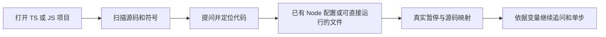

# Stage 02：TypeScript / JavaScript 代码阅读与 Node 调试

基线：6babced80a8aa9617fcded8e7359f9d997cdfbc7；分支 main；版本 0.1.7。用户授权实现 TS / JS 支持。本轮保留在工作树，未提交或推送；此文档是本地实施记录，不是已发布 issue。

## 问题与方案

用户在 TS / JS 仓库提问被“没有 Python 文件”拦截。将索引和问答语言范围扩大，同时接入真实 Node 暂停，让定位、提问与验证可连续进行。保持当前简洁界面，不新增语言选择器。

图名：TS / JS 问题到运行证据｜图型：用户流程｜阶段：stage-02。使用 Mermaid，未连接 draw.io。

## 范围与边界

扫描 py、ts、tsx、mts、cts、js、jsx、mjs、cjs，排除依赖与构建目录。TS / JS 优先调用内置文档符号服务，1.5 秒上限后声明扫描兜底；它不等价于完整调用图。路径解析仍拒绝越出工作区。

运行时支持 node / pwa-node，优先采用 launch.json；JS 可直接启动，TS 可用项目已安装的 tsx；无加载器时明确要求配置编译入口和 sourceMaps。TSX/JSX 可索引，执行需要项目 Node 构建配置。浏览器、自动安装加载器、自动运行 package script 不在本轮范围。

Python 调试扩展改为按需安装，JS 项目不再被强制依赖 Python。Python 原有流程保持。

Node 的启动器与实际进程分属父子调试会话；停止事件来自已跟踪会话的子级时，转到真实执行会话再捕获证据。尚未覆盖多进程并行调试。

## 验证路径

- `npm run check`：类型检查。
- `npm run smoke:vscode`：新增纯 TS / JS 工作区，通过公开问答与调试命令验证索引、JS 自动启动、TS source map 原文件断点、变量与源码采集、两次连续追问；再运行原有 Python 两组回归。
- Webview：复用实际 HTML 行为、主题与对比度测试。
- 模型回答使用受控响应，证明请求上下文与状态流，不代表在线模型质量。

测试曾发现 Node 子会话暂停无法被父级观察器捕获，已按真实会话关系修正。TS 测试采用 tsc 编译 + source map，不把裸 V8 行号断点能否绑定推断为 VS Code 能否绑定。

Example：[user_code](../../examples/stage-02-node-conversation/user_code/README.md) → [core](../../examples/stage-02-node-conversation/core/README.md)。

## 实测结果（2026-09-22）

类型检查、三组真实 Extension Host 测试全部通过。Node 测试覆盖纯 TS / JS 项目问答、JS 自动启动、TS 编译映射断点和每次暂停后的两轮追问。两组原有 Python 回归通过。真实 Webview HTML 的交互、主题覆盖、对比度及五种渲染视图通过；日志为 `.vscode-test/stage-02-smoke.log`，截图在 `.vscode-test/ui/`。

TS + tsx 自动配置分支已实现；本轮真实 TS 调试验证使用 tsc + sourceMaps，未另作 tsx 加载器集成验证。JS/TS 调试验证不是裸 CDP 模拟，断点由 VS Code 的 js-debug 实际命中。
