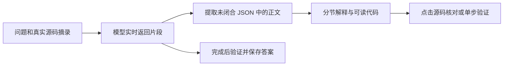

# Stage 03：流式回答与有依据的代码阅读

基线提交：6babced80a8aa9617fcded8e7359f9d997cdfbc7；基于 stage-02 工作树继续实现。版本 0.1.8；未提交推送。本地实施记录，未发布外部 issue。

## 用户问题

用户看到长时间“正在思考”，最终得到一段堆满符号的文字。插件需要让人逐步理解代码，而不是增加阅读负担。

## 实现与边界

图名：实时解释到源码验证｜图型：数据流｜阶段：stage-03。Mermaid；未连接 draw.io。

OpenAI Responses、Chat Completions、Anthropic、Gemini 使用 SSE；VS Code 内置模型逐段回传。网络输出不再积攒到完成才展示。正文约每 70ms 更新一次，保留原有输入与滚动状态。流式预览不持久化，最终 JSON 校验仍保留；失败、取消和迟到片段不会成为完成答案。服务不支持 SSE 时明确报错，不用打字动画伪装实时输出。

提示词要求先回答问题，再按需要用标题、短段落、顺序阅读、小段代码与一个验证方向展开，不强迫每条简单回答套模板。索引上下文附最多 4 个文件、每段最多 65 行 / 5000 字符的真实源码；不把未提供的代码当仓库原文。

代码块增加语言标识、基础高亮、复制；相对源码引用通过宿主校验再跳转，拒绝越界路径和任意协议。历史观察引用打开的是当前文件，不能证明文件未变。模型文本仍不作为 HTML 插入。

## 验证结果（2026-09-22）

- 类型检查通过。
- 三组真实 VS Code 测试通过：JS / TS 断点、Python 普通入口与项目脚本入口。
- 四种协议的本地 SSE 服务验证通过：真实增量、拆分 UTF-8、CRLF 事件、JSON 转义、用量、断流、取消。
- 命令链路验证生成中的正文状态、取消清理与迟到片段抑制。
- 实际 Webview 渲染验证通过：流式标题、高亮代码、源码点击消息、复制、输入草稿保留，以及原有主题与对比度检查。
- 已查看 `.vscode-test/ui/streaming-reading-360.png`；截图是受控示例，非在线模型输出。
- 日志：`.vscode-test/stage-03-smoke.log`。未使用用户 API Key 做在线教学质量评估。

Example：[user_code](../../examples/stage-03-streamed-reading/user_code/README.md) → [core](../../examples/stage-03-streamed-reading/core/README.md)。

## 0.1.9：历史断点入口修复

原先调试邀请只显示当前路径，并在出现暂停记录后隐藏，旧回答也不持有路径。现在每条路径回答保存 RoutePlan，重开会话仍可查找；历史回答保留打开源码与断点操作。运行中只补断点，不改当前路径；未运行时恢复指定历史路径再启动，不重复提问或重新调用模型。验证文件和行号，失效时明确提示。旧版仅能回退到最后保存的匹配路径，不虚构丢失的历史位置。

验证覆盖两条不同历史路径、恢复时消息不重复、持久化后重新读取，以及暂停后历史入口仍可见、点击使用正确消息 ID。
