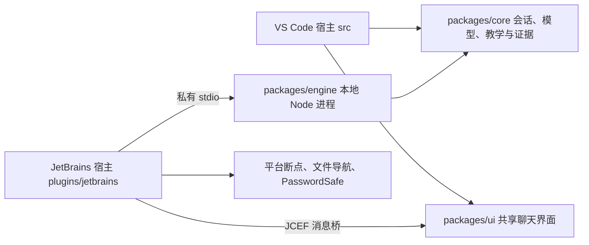

# Stage 04：共享核心与 JetBrains 宿主

用户授权执行“一个共享核心、VS Code 与 JetBrains 两个插件端”。基于 main 的 0.1.9 未提交工作树继续，保留此前改动。本轮不自动提交、推送或发布。

目标：将会话、模型调用、教学提示与证据规则抽出 VS Code；原插件经适配继续运行；通过本地标准输入输出协议接入 JetBrains，验证一个 TS 断点场景。

分层：packages/core（无 IDE 导入）→ packages/engine（本地进程及文件系统适配）→ plugins/jetbrains（平台 API、调试、密钥与 UI 桥）；src 暂保留 VS Code 产品入口以降低迁移风险。共享网页界面继续由两端宿主承载。

Example：examples/stage-04-shared-core/user_code/main.cjs，通过核心公开入口创建会话并完成问答；inventory.ts 提供真实调试样例；core/README.md 映射实现。关键断点：SessionStore.recordPause、AiTutor.answerPauseQuestion、本地协议 dispatch、JetBrains sessionPaused。验证：独立 Node 核心与协议测试、现有 VS Code 三组测试、Webview 测试、使用本机 WebStorm SDK 编译并尝试隔离宿主验证。

失败边界：未知协议请求被拒绝；取消不接受迟到回复；宿主退出结束子进程；源码跳转限制在项目内；JetBrains 缺失调试能力时明确说明。不宣称全 JetBrains 产品和语言已经支持。

本机发现 WebStorm 2025.1.3 与 PyCharm；系统无全局 JDK/Gradle，可使用 WebStorm 自带 JBR 与 SDK。部署方式初期使用明确配置的 Node 可执行文件，本地进程不监听网络端口。后续是否捆绑运行时由实测再定。

## 最终边界

没有把整个插件重写两遍。核心通过 `ports.ts` 接收项目索引、模型、存储和取消；VS Code 旧导入路径薄转发到核心输出，原测试仍覆盖同一实现。共享 UI 仅要求消息桥和主题变量。

Engine 的暂停/恢复/停止消息串行处理，避免读源码期间的恢复事件被迟到暂停覆盖；模型请求保持可取消。调试命令同时校验当前快照和宿主 sessionId，历史快照不驱动另一个活动会话。模型密钥只在进程内存与宿主 PasswordSafe；会话文件不含模型配置。路径解析经 realpath 限制在项目中。手动断点不删除。

JetBrains 预览版使用顶层暂停位置与源码，未实现变量、完整调用栈、自动创建运行配置、跨 IDE 历史同步。构建兼容范围限制为251；不把 WebStorm 结果外推到其他产品。系统 Node 路径可配置，尚未捆绑运行时。

## 验证记录（2026-09-22，未提交工作树）

- `npm run check`：通过，核心与 UI 不导入 vscode。
- `npm run test:engine`：通过。普通 Node 公开 API 示例；本地 SSE 测试验证流式片段、取消、持久化、源码越界拒绝和仅当前暂停可用的控制。协议测试中的 pause 是明确标注的 fixture，不算真实 IDE 证据。
- `npm run smoke:vscode`：三组真实宿主均通过，含 JS 自动启动、TS source map、Python 暂停、pyproject 入口、四类模型协议流式与历史路线。日志 `/tmp/codecat-stage04-vscode.log`。
- `NODE_PATH=… node test/webview/index.cjs`：通过，行为、主题、对比度与五张实际渲染图，产物 `.vscode-test/ui/`。
- WebStorm 2025.1.3：隔离 SDK 编译通过；真实 Node 调试经 source map 停在 `main.ts:3`，共享引擎会话文件保存 `已记录观察：main.ts:3`。隔离目录 `.vscode-test/jetbrains`，不读取用户模型密钥。
- VSIX 打包已检查包含 `packages/core/dist` 和 `packages/ui/dist`，排除源码、JetBrains 与本地引擎。两个产品均为本地安装包，未发布。

示例入口：[普通 Node 会话](../../examples/stage-04-shared-core/user_code/main.cjs)、[真实调试库存函数](../../examples/stage-04-shared-core/user_code/inventory.ts)。安装：[JetBrains README](../../plugins/jetbrains/README.md)。

- `npm run smoke:jetbrains` 最终通过实际 JCEF DOM 验证：页面包含 `暂停于 main.ts:3`、真实源码 `console.log(remaining);`、解释与单步入口；快照同时已持久化。结果位于 `.vscode-test/jetbrains/result.txt` 与 `.ui.txt`，日志 `/tmp/codecat-stage04-native-ui3.log`。分发 JAR 已确认不包含 SmokeStartup 或测试注册。

## 0.2.1 · JetBrains 阅读样式修订

源码链接曾同时继承 `.action` 的最小高度和浅色 hover fallback，导致深色主题中出现白色按钮块。改为明确的行内链接尺寸与语义色 hover；JetBrains 补全深色悬停颜色，以编辑器背景/正文色为基准。宿主已提供标题，网页隐藏重复品牌标题；隐藏底部冗长快捷键提示并缩小输入区，正文列表恢复正常空白布局。

真实网页回归加入 JetBrains 深色行内链接悬停断言、标题与快捷键显隐检查，截图 `.vscode-test/ui/jetbrains-reading-dark.png`。原明暗与高对比度布局、复制、源码跳转、流式行为测试均通过。

## 0.2.2 · 本地符号实现检索

修复前确认 agent-boot 根 package.json 的 name 为 @agent-boot/core，定义实际位于 src/capability/definition.ts 的 defineCapability。原引擎对包含同名词的文件等权排序，并只取前四个文件的开头，导致示例挤掉声明。修复目标：声明优先、声明周边摘录、本地 package 名称映射、截断范围明确；不能把上下文缺失解释为仓库缺失。验证使用构造的多示例/深层定义场景，以及只读检查实际 agent-boot 仓库。

已完成实现：JetBrains 主源码优先、2000 文件上限及截断提示、精确声明优先、定义周围85行/7000字符摘录、本地 package 身份。VS Code 保持可配置文件上限，同时优先主源码目录、围绕匹配符号摘录并补包身份。共享提示明确“检索缺失不等于仓库缺失”，新证据应纠正历史误判。

检索回归覆盖8个调用示例先于定义文件、定义在160行以后以及包自引用。实际 agent-boot 验证上下文包含 @agent-boot/core => . 与 src/capability/definition.ts 的 defineCapability 声明和正文；该仓库超出2000文件，输出明确标记 partial scan。旧测试曾要求不同问题的所有上下文逐字相同，已改为文件/符号清单稳定、源码摘录随问题变化，符合本次修复目标。

0.2.2 验证：npm run check、test:engine、smoke:vscode 三组真实宿主测试及两端打包通过。日志 /tmp/codecat-retrieval-{check,engine-final,vscode-final,package,build-final}.log。未调用用户模型验证最终措辞；确定性验收的是正确实现已经进入模型上下文。未提交、推送或自动替换已安装插件。

## 0.2.3 · 断点目标与启动入口

用户截图断点目标是 issue-6/main.ts，读取实际工作区运行配置发现选中的是 issue-3/main.ts。原生适配无条件运行 selectedConfiguration，故不会经过新断点。现改为精确匹配文件的已有 Node 配置优先；不匹配时显示完整目标和当前入口，用户可选择复制现有 Node 配置调试目标文件、明确选择已有配置或仅放断点。复制保留加载器/解释器/参数，不改原配置；只有原 workingDirectory 等于原入口父目录时调整到新入口目录。库文件应选择调用它的入口，不能自动保证必经断点。

调试启动即标记运行中，结束无暂停时明确提示入口/source map 检查。测试构造旧入口 other.js，复制到 main.js，校验旧配置保持不变，并真实运行到 TS 断点和 JCEF 页面。

0.2.3 验证：test:engine、check 通过；smoke:jetbrains 通过错误旧入口→复制目标入口→真实 TS source-map 断点→JCEF 观察呈现，且断言原配置未被修改。日志 /tmp/codecat-launch-fix-verified.log。未在用户 agent-boot 中执行示例，未修改其运行配置，也未自动更新用户插件。

## 0.2.3 远程同步记录

用户已授权提交并同步到 origin/main。实现提交：`7507e80b6d02eb62d385ad238ced41c1167973ad`，标题：`feat(ide): 共享代码阅读核心并接入 JetBrains 调试预览版`。本次记录覆盖 Stage 02–04 与 0.2.1–0.2.3 修复；前文“未提交/未推送”描述的是当时验证状态。提交前再次执行 npm run check 与 git diff --check，通过。安装包、依赖和测试沙箱为构建产物，不纳入 Git；构建与复现入口已随源码同步。

## Marketplace 免费预览版准备（2026-09-23）

用户授权免费发布。发布前补充 English listing、change notes、40px SVG 图标、MIT 许可随包分发、隐私说明和 Marketplace 提交工作表。声明 NodeJS 为必需依赖，继续把兼容范围限制到 251.*；不能把 WebStorm 一台机器的验证外推到其它产品。真正提交、平台审核和安装页出现是独立状态，后续据实际结果记录。

发布包验证：`npm run check` 通过；`npm run smoke:jetbrains` 首次在 JCEF 页面探针处超时，但已记录真实 TS 暂停，再次运行完整通过并保存 JCEF 页面文字；发布包检查确认包含 LICENSE、图标且不含 SmokeStartup。JetBrains Plugin Verifier 1.410 对本机 WebStorm WS-251.26927.40 判定 Compatible，报告仅有两处 deprecated `Messages.showChooseDialog` 用法，没有兼容性错误。构建 ZIP 位于 `plugins/jetbrains/build/`，为忽略的本地产物。
