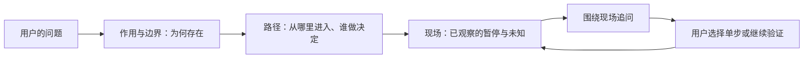

# Stage 05：从全局理解到可追问的调试现场

用户反馈：只显示“停在某行”和一段术语解释，仍需自己拼出代码作用、模块定位与调用目的。新的主线是先建立高层心智模型，再沿一条可信的源码路径深入，最后把真实暂停作为可以连续提问和验证的现场。

图名：从项目作用走到可验证的代码现场｜图型：用户流程｜阶段：stage-05。

验收场景沿用 `examples/stage-04-shared-core/user_code/inventory.ts`：用户先问库存处理在项目里承担什么，再沿调用点到库存判断处暂停。进入现场时，界面先交代这处代码在阅读路径中的位置，明确区分源码线索和真实暂停，提供“它在整条链路负责什么”“这一行将改变什么”“下一步看什么”三条可编辑追问；用户也可自己输入问题。单步仍由用户主动触发，模型不执行表达式或编造变量。

边界：JetBrains 当前仅采集顶层位置与附近源码；没有变量或完整栈时必须直说。阅读路径是源码推断，不提升为运行事实。历史快照可以追问，不能对已结束的现场单步。UI 和提示词放在共享包，两个宿主复用。

验证：`npm run check`、`npm run smoke:vscode`、`npm run smoke:jetbrains`，并在实际 Webview 渲染中检查窄宽度与 JetBrains 深色主题。使用真实暂停作调试链路证据；Webview fixture 只验证交互与呈现。

## 本轮实现与证据（2026-09-23）

基线 `main/9c8ad515c3ebdabfa69df2b58007416bcfd790eb`。共享提示词将项目概览问题通常导向“高层回答 + 渐进代码路径”，暂停追问根据既有对话继续深入；没有改变模型协议或把源码推断写成运行证据。共享暂停卡片加入路径职责线索、真实观察提示、缺失变量的可见说明和三个可编辑追问入口。建议问题只写入输入框，保留用户修改与主动发送的控制权；单步仍是独立操作。

`node --experimental-strip-types examples/stage-05-guided-depth/user_code/checkout.ts` 输出 `可以继续支付`。`npm run check` 通过；`npm run test:engine` 与实际 Webview 测试通过，后者覆盖推荐问题写入、路径线索、变量缺失、窄宽度、深色主题和五份渲染截图。`npm run smoke:vscode` 的真实宿主断点链路通过；`npm run smoke:jetbrains` 的 WebStorm TS 真暂停与 JCEF 呈现通过。两项宿主冒烟测试在最后一处提示词分类与缺失变量文案微调前运行；微调后共享引擎和 Webview 回归通过。没有使用用户模型评估自然语言回答质量。工作树尚未提交或推送；Marketplace 正在审核的 `0.2.3-preview` 包不包含这轮改动。

为本地重装测试，将仓库和 JetBrains 插件版本升至 `0.2.4-preview`，构建脚本输出独立文件名，避免与 Marketplace 审核中的 `0.2.3-preview` 混淆。仍未上传新版本；以本地 ZIP 供测试。

## PyCharm 261 本地兼容包

用户的 PyCharm 2026.1.4 为 `PY-261.26222.68`，此前 `until-build="251.*"` 的 WebStorm 包被安装器拒绝。构建脚本现读取目标 IDE 的 product-info，分别用 251/261 SDK 编译并生成独立 ZIP，描述符限制到对应 build 分支。初次 261 包虽通过 Plugin Verifier（仅两处弃用 API），隔离启动却发现 PyCharm 免费版禁用了 JetBrains Ultimate → JavaScript Debugger → NodeJS；Code Cat 原有硬依赖随之禁用。261 包移除对 NodeJS IDE 插件的硬依赖；251 WebStorm 包继续声明依赖，保持该产品的插件类加载范围。最终 261 包再跑 Plugin Verifier，结果 Compatible，仅两处弃用 API。隔离 PyCharm 启动显示 Code Cat 已加载，JCEF 宿主成功创建；页面文字回读探针未回传，因此不声称页面内容已渲染验证，更不声称 Python 真断点已验证。WebStorm 251 回归真实命中 `main.ts:3`，JCEF 页面回读和共享引擎保存观察均通过。

用户安装 PyCharm 包后遇到“操作未完成，请检查本地引擎是否已启动”。该文案来自 JCEF 消息处理的总 catch，原先把所有异常隐藏；代码同时在 `browser.loadHTML` 后才 `engine.start`，页面的 `ready` 有机会先到。尝试调整加载顺序、缓存请求和引擎按需启动，都让 WebStorm JCEF 冒烟连续超时；回退这些更改后真实暂停恢复通过。因此本轮不把启动竞态当成已确认根因，也不保留未经回归的时序修改。最终只在弹窗中保留异常原因；引擎异常退出时显示退出码和限长 stderr 诊断。隔离 PyCharm 测试增加向真实引擎发送 `ready`，证明进程能接受请求，但页面回读仍无回传，原因未确定。用户须安装 `0.2.5-preview` 后提供新的具体错误，才能进一步确认真实根因。

为便于用户区分已安装的旧包，本次 JetBrains 本地插件版本升为 `0.2.5-preview`；VS Code 包版本不随此宿主修复改变。

最终回归中，WebStorm 251 真暂停 / JCEF 回读冒烟曾多次在 50 秒限时内超时；保持生产代码不变重跑后完整通过，测试沙箱日志确认调试器启动。该间歇性超时未定位，不能当成产品功能确定通过率。PyCharm 261 隔离启动与引擎 `ready` 检查通过，`npm run check` 和 `git diff --check` 通过。页面往返仍是未验证项。工作树尚未提交、推送或发布。

第一次 `npm run build:jetbrains` 构建成功。检查 ZIP 内 `plugin.xml` 为 `0.2.4-preview`，内置引擎含新的高层理解提示词，JCEF 页面含“先看作用”和“真实观察”。随后加入组织图并重新构建同名本地文件；最终校验值见下文。`git diff --check` 通过；工作树仍未提交，构建包受忽略规则排除。

## 对话内的代码组织图

在“高层理解 → 深入源码”之间加入一张紧凑的相关代码组织图。数据仅来自当前 `RoutePlan` 中已经校验可打开的文件路径；宿主只投影相对路径与节点 ID，UI 按目录包含关系分组。线条表示文件组织，不表示调用或执行。默认控制在少量目录和文件，按需展开；点击文件仍走宿主现有的 `selectRouteNode` 导航。模型的职责解释留在正文和阅读路径，不把文件名推断成未经验证的模块职责。断点命中后，组织图仍保留在原回答旁，便于从全局位置返回现场。

验证结果：`npm run check`、`npm run test:engine`、实际 Webview 测试通过；Webview 测试覆盖默认四目录、展开、点击源码节点，以及 360px 浅色与 JetBrains 深色截图。`npm run smoke:vscode` 首次在已有富文本断言处得到 0 而非 2，第二次完整通过；这次 UI 变更未触及富文本解析，该一次性失败仍记作未定位的宿主时序风险。`npm run smoke:jetbrains` 真实 TS 暂停与 JCEF 呈现通过。最终 ZIP 内含组织图和引擎投影、版本为 `0.2.4-preview`，无测试启动器；SHA-256 为 `bef04207ea70ea02c7369825a2e82be9d849fbff7b54352adfd023c2426e726d`。本轮尚未提交、推送或发布，Marketplace 审核中的 `0.2.3-preview` 未变化。

`npm run package` 生成本地 VS Code 包 `code-cat-0.2.4.vsix`，包内核对包含组织图和 VS Code 宿主投影；SHA-256 `1e81d984dd04c648422e352d1aa954a6459fb67f00583d2db91e3fbbfc6ef7ca`。两个安装包均为本地构建产物，不代表用户当前 IDE 已重装。

## 0.2.6-preview：自动发现 JetBrains 本地引擎

PyCharm 配置截图暴露了前一轮排障写入项目设置的 NVM 绝对路径，并被模型配置对话框误呈现为常规必填项。JetBrains 端现从模型配置中移除 Node 路径字段；引擎启动时优先兼容已保存的显式路径，再自动搜索 PATH、NVM、Volta、asdf 和常见 macOS 位置，并拒绝低于 Node 20 的版本。自定义安装可用 `CODECAT_NODE` 覆盖。引擎不可用时显示实际诊断，不再误导用户去模型设置中找 Node 路径。Marketplace 审核包未变。

验证：`npm run check` 与 `git diff --check` 通过；`CODE_CAT_JETBRAINS_HOME=/Applications/PyCharm.app/Contents npm run smoke:jetbrains` 通过。隔离 PyCharm 项目没有预设 `codecat.node`，Code Cat 加载并成功启动本地引擎、接收 `ready`；构建产物为 `0.2.6-preview` PyCharm 261 本地 ZIP。该包已替换用户本机的 `0.2.5-preview` 并重启，进程检查确认新插件和 Node 引擎均已运行；旧插件目录备份在 JetBrains 缓存中。此前实际项目的模型请求提示先配置模型，因此模型响应和 Python 真断点仍未验证。工作树保持未提交；没有推送或发布。

## 交互质感补齐（2026-09-24）

用户反馈：输入框、选择器等控件缺少交互反馈与光标变化。本轮只改 `packages/ui/src/runtimeMapStyles.ts`，两个宿主共享同一份样式。

选择器 `.evidence-context select` 此前只有 `:focus-visible`，没有任何指针或悬停反馈。现在补 `cursor: pointer`、32px 最小高度、6px 圆角，并用两条 `linear-gradient` 拼出自定义下拉箭头——颜色取 `currentColor`，因此明暗主题自动适配，不需要额外 DOM 或按主题写两份颜色。悬停时边框与底色跟随 accent。

输入框侧：`.composer-inner` 的焦点反馈从硬切换的 `outline` 改为可过渡的 `box-shadow`，聚焦时光晕能平滑出现；`textarea` 补显式 `cursor: text`、`::selection` 底色和细滚动条。

一致性方面：把 `.tab`、`.stack-frame`、两个 `summary`、`select` 纳入统一过渡列表并补 `:active` 按压反馈；`button` 的 `focus-visible` 描边由 1px 改为 2px，与 `summary`、`select` 原本的 2px 对齐；`.action.primary:disabled` 补明确禁用样式。另外把 7 条散落在 `@media (hover: hover)` 之外的悬停规则收进媒体查询，触摸设备不再粘住悬停态。行内源码链接与栈位置保留文本可选中，只对按钮和摘要禁用选择。

验证：`npm run check`、`npm run test:engine` 通过；Webview 渲染测试通过（行为、主题覆盖、对比度与 5 张截图）。另用探针读取计算样式确认：`select` 的 `cursor=pointer`、`appearance=none`、箭头渐变生效、`min-height=32px`；`textarea` 的 `cursor=text`、`scrollbar-width=thin`；`.composer-inner` 过渡包含 `box-shadow`。新增截图 `tools-panel-420.png`、`composer-420.png`、`composer-focused-420.png`、`full-with-select-420.png`，均在 `.vscode-test/ui/`。

踩到的坑记在这里：起初把 `.observation-location` 一并放进统一过渡列表，其中含 `color 120ms`，于是主题覆盖测试同步读取 `color` 时拿到的是过渡起始值而非终点值（相邻的 `waitForFunction` 断言因为会等待反而通过）。该元素悬停只改下划线颜色，本就不需要颜色过渡，改为只过渡 `text-decoration-color` 后测试恢复。给会随主题变化的元素加颜色过渡前，先确认没有同步读取该颜色的断言。

## 断点无法重新开始：debugSessionId 残留（2026-09-24）

用户反馈：对话中打过一次断点、产生过观察快照之后，再问别的问题就无法重新开始新的断点。

根因在 `src/debug/debugSessionObserver.ts` 的会话跟踪。js-debug（Node）用 launcher 会话加 child 会话两个会话：断点命中时观察器把 `debugSessionId` 切换到**子会话**（`observeAdapterMessage` 里沿 `parentSession` 找到引导会话后 `beginDebugSession(session.id)`），而 `onDidTerminateDebugSession` 收到的往往是**父会话**的终止事件。`SessionStore.endDebugSession` 开头有 `debugSessionId !== sessionId` 就 return 的守卫，于是子会话 id 永远留在 store 里——子会话随父会话一起结束，不会单独发终止事件。

残留字段造成三个症状，同一个根因：

1. `src/views/runtimeMapView.ts` 投影的 `debugging = Boolean(state.debugSessionId)` 恒为 true，界面停在「断点验证进行中」，操作区只剩「查看运行时信息」。
2. `SessionStore.applyRoute` 的 `preserveDebugSnapshot = Boolean(this.state.debugSessionId)` 为 true，新问题不再清空 `pauses`；而 `runtimeMapScript` 只在 `pauses` 为空时渲染核心代码位置卡，于是新问题连引导入口都消失。
3. `createDebugAdapterTracker` 用 `!this.store.snapshot().debugSessionId` 判断是否接管新会话，残留让之后的引导调试**根本不被观察**，命中断点也没有任何反应。

修复：

- `trackedSessions` 从 `Set<string>` 改为 `Map<string, vscode.DebugSession>`。父会话终止时，若观察中的会话是它的后代（沿 `parentSession` 上溯判断），一并调用 `endDebugSession` 并触发 `onGuidedSessionEnded`。
- 核心位置卡渲染条件由 `!pauses.length` 放宽为 `!pauses.length || !debugging`：调试现场仍活跃时让位给观察卡片，调试结束后当前问题重新获得引导入口。
- 「断点验证已结束」且有快照时补「用断点跟一遍」入口；「断点验证进行中」的说明补一句先停止当前调试的提示。

没有做的事：`debugging` 仍只看 `debugSessionId`，没有改用 `vscode.debug.activeDebugSession` 做二次判断——该 API 在终止事件期间存在时序不确定性，而根因修复后残留不再产生。

修复前已被卡住的会话，恢复路径是重启 IDE 或新建会话：`stateFromConversation` 会把 `debugStatus` 重置为 `idle` 且不恢复 `debugSessionId`，所以脏状态不落盘。

## 验证环境：VS Code 冒烟需要非 zsh 的默认 shell（2026-09-24）

`npm run smoke:vscode` 在本机沙箱里连续四次卡在 `test/node/index.js` 的 `Timed out: js actual source breakpoint`，诊断恒为 `debugStatus: "running"`、`pauseCount: 0`。

先用基线对照排除代码回归：`git stash` 回到 `main/9c8ad51` 后症状完全相同，所以与本次改动无关。

根因是沙箱拦截 zsh 启动写入（`.zcompdump`、`.zsh_history.LOCK`，见命令 stderr 的拒绝清单）。Node 与 Python 的引导调试都用 `console: "integratedTerminal"`，集成终端拉不起来，被调试进程从未启动，断点自然不会命中。

两个变量的隔离结论：只清空隔离扩展目录 `.vscode-test/code-cat-extensions`（连带消掉 pylance 自动更新）仍然失败；只把默认 shell 换成 `sh` 就通过。可用的运行方式：

    env -u ELECTRON_RUN_AS_NODE SHELL=/bin/sh npm run smoke:vscode

以该方式三组套件全部通过：Node（JS/TS 索引、JS 自动启动、TS source map 断点、证据采集）、Python smoke（模型适配、激活、联动断点、调试快照、两个视图、重复操作防护）、Python entrypoint（pyproject console script 断点）。诊断里 `interactionMotion.tabTransitionDuration` 为 `0s`，`.tab` 的即时性约束保持成立；`actionTransitionDuration` 为 `0.14s, 0.12s, 0.12s, 0.12s, 0.12s`，指针反馈仍是非零短过渡。

## 阅读路径的职责与关系（2026-09-24）

用户反馈：代码组织图本身很好，但回答只给出链路，没有解释「为什么要这样架构、彼此是什么关系」。

`RouteNode` 增加两个可选字段：`role` 说明这个文件或模块在本项目里负责什么、为什么存在；`relation` 说明它与上一个节点的关系（谁调用谁、数据从哪来、跨越了哪条边界），首个节点不填。`ROUTE_NODE_SCHEMA` 同步扩展，两者上限各 160 字符，`parseRoute` 对非字符串值保持为空。字段可选，因此旧模型输出仍能解析，界面只是不占位。

`routeInstructions()` 现在要求每个节点都填 `role`、首个之后的节点填 `relation`，并明确三者的分工：`role` 与 `relation` 讲设计，`reason` 讲为什么停在这一行，不得互相复述。

共享 UI 侧：路径卡在「为什么停在这一行」之上新增「职责：…」与「↳ …」两行，`role` 用 accent 竖线、`relation` 用推断色，与已观察证据的配色体系保持区分；代码组织图的文件卡改为优先显示 `role`，缺失时回退 `title`，并给该行加两行截断，避免长职责把整张图撑高。两个宿主的 `organizationFiles` 投影补上 `role`（`route.nodes` 本身靠对象展开自动携带）。

验证：`npm run check` 通过；`npm run test:engine` 的 Engine 与 Retrieval 通过；Webview 测试新增三条断言（组织图优先显示职责、无职责时回退标题、关系行只出现在首个节点之后）并通过，新增截图 `path-node-role-360.png`，该套件现在共 6 张视觉截图；`env -u ELECTRON_RUN_AS_NODE SHELL=/bin/sh npm run smoke:vscode` 三组套件通过，VS Code 宿主新增 `renderedArchitectureRoleText` 诊断，用来证明职责确实穿过宿主投影抵达渲染。

这里踩到一个值得记的坑：Webview 诊断字段不是自动透传的。`src/views/runtimeMapView.ts` 里有四处显式白名单——`RenderedDiagnostics` 接口、`emptyRenderedDiagnostics()`、`sanitizeRenderedDiagnostics()`，以及 `__smokeState` 把字段重命名为 `rendered*` 的映射。漏掉任意一处，新诊断在宿主冒烟里就是 `undefined`，而 Webview 测试因为直接读 DOM 仍然通过。新增诊断字段时必须四处一起改。

## 本地插件升级到 0.2.4 / 0.2.7-preview（2026-09-24）

把工作树的最新改动（含上面的 `role`/`relation`）构建并装到本机三个 IDE。基线 `main/9c8ad51`，工作树改动未提交。

产物：

    code-cat-0.2.4.vsix                                     114 files, 189.98 KB
    plugins/jetbrains/build/code-cat-jetbrains-0.2.7-preview-webstorm-251.zip
    plugins/jetbrains/build/code-cat-jetbrains-0.2.7-preview-pycharm-261.zip

安装方式与结果：

- VS Code：`code --install-extension code-cat-0.2.4.vsix --force`（同名 0.2.4 需覆盖）。`code` 不在 PATH，真实路径是 `/Applications/Visual Studio Code.app/Contents/Resources/app/bin/code`。校验：`--list-extensions --show-versions` 得到 `local.code-cat@0.2.4`。
- WebStorm 2025.1 / PyCharm 2026.1：备份旧目录后解压新包。ZIP 顶层就是 `code-cat/`，因此直接解压到 `<IDE>/plugins/`。备份标签 `20260924-145259`，路径为 `<IDE>/code-cat-backup-20260924-145259`。校验：两处 `lib/code-cat.jar` 内 `META-INF/plugin.xml` 均为 `0.2.7-preview`，各 45 文件 / 368K。

两个 JetBrains IDE 安装时处于运行状态（`pgrep` 计数 10）。macOS 下替换插件目录不会被文件锁拦住，但已加载的插件仍在旧版本的类上运行，需要重启 IDE 才会生效。

## 打包污染：VSIX 曾把工作区记忆打进去（2026-09-24）

`code-cat-0.2.4.vsix` 第一次打包有 116 个文件，多出的是 `extension/.workbuddy-ai/memory/MEMORY.md` 与 `2026-09-24.md`。`.vscodeignore` 原本只挡了 `verification-*/` 与 `*.vsix`。

补上 `.vscodeignore` 的 `.vscode-test/**` 与 `.workbuddy-ai/**` 后重新打包，回到 114 文件 / 189.98 KB，`unzip -l | grep -cE "workbuddy-ai|vscode-test"` 为 0。新增会被打进包的工作区目录时，记得同步 `.vscodeignore`。

## 输入框整体读作文本框（2026-09-28）

用户反馈：光标移入输入框时应该变成输入符号（I 形），实际大部分区域是箭头。

用 playwright 探针读 `elementFromPoint` + `getComputedStyle` 量出真实情况：输入框 332×84，只有中间 36px 的 `textarea` 行是 `text`，内边距、`#composer-mode` 标签、`.composer-meta` 空白全是 `auto`——占了整块面积的大半。根因是上一轮「交互质感补齐」只给 `.composer textarea` 补了 `cursor: text`，容器 `.composer-inner` 没写，于是容器自己的区域和不接收文本的子元素都回落到默认箭头。

修法（仍只改 `packages/ui/src/runtimeMapStyles.ts`）：`.composer-inner` 加 `cursor: text`，再用 `.composer-inner button { cursor: pointer }` 把按钮拉回手型、`.composer-inner button:disabled { cursor: default }` 保持禁用态的默认箭头。

特异性上踩了一次：`button:disabled` 与 `.composer-inner button` 都是 (0,0,1,1)，同分靠源码顺序决胜，先写的 `.composer-inner button` 会被后写的 `button:disabled` 压住，禁用按钮会变成手型。必须写成 `.composer-inner button:disabled`（(0,0,2,1)）才压得住。

验证：探针的前后对比本身就是负向证据——修复前 `#composer-inner` / `#composer-mode` / `.composer-meta` 都是 `auto`，修复后都是 `text`；禁用的发送按钮 `default`，填入草稿后变 `pointer`。`test/webview/index.cjs` 新增 6 条断言（容器、模式标签、meta 行、禁用按钮、启用按钮及其箭头 span）。`npm run check`、`node test/webview/index.cjs`（7 张截图）、`env -u ELECTRON_RUN_AS_NODE SHELL=/bin/sh npm run smoke:vscode`（三组）全部 Exit 0。

发版：VS Code `0.2.7 → 0.2.8`（`code-cat-0.2.8.vsix`，117 文件 / 207.12 KB）、JetBrains `0.2.10-preview → 0.2.11-preview`（webstorm-251 与 pycharm-261 各 48 文件），都已装到本机三个 IDE；读回产物确认 `packages/ui/dist/runtimeMapStyles.js` 与 jar 内 `codecat.html` 都含新规则。旧插件目录已备份到 `plugins/` 之外。
