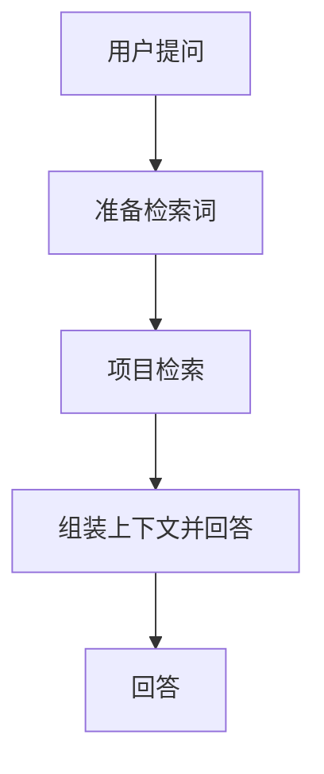
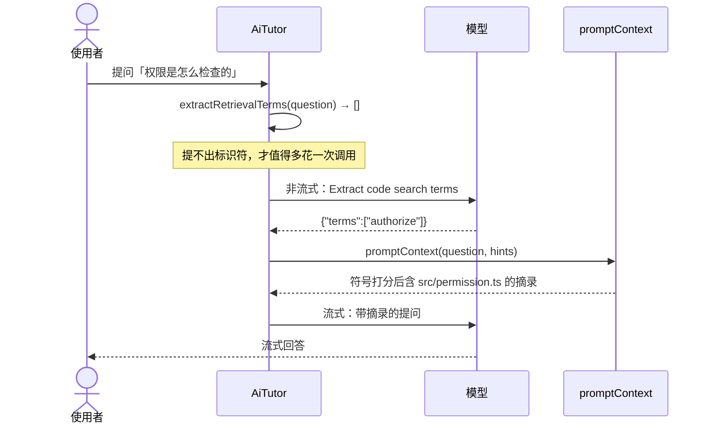
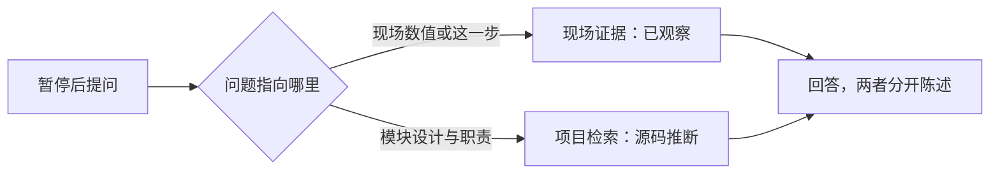

# [feature] 中文提问命中相关源码，暂停追问保留项目上下文

> 状态：已实现并验证（2026-09-28）。范围与验收标准见下，实际结果见文末「实现完成回填」。
> 基线：`main/f5bad9e`。

## 背景与问题

用中文提问时，检索链路拿不到任何检索词，模型看到的是与问题无关的源码摘录。

两端提取检索词用的是同一个正则：

```js
question.toLowerCase().match(/[a-z_][a-z0-9_]{2,}/gu) ?? []
```

VS Code 侧在 `src/project/projectIndex.ts:238`（`tokenizeQuestion`），JetBrains 侧在 `packages/engine/src/project.ts:48`。它只匹配拉丁字母开头的标识符，纯中文问题（例如「权限是怎么检查的」）提取结果为空数组。

后果是连锁的，而且**不会报错**：

1. 词集为空 → `scoreSymbol` 对所有符号返回 0；
2. `selectPromptSymbols` 的「相关尾部」为空，选中集合退化为按文件路径字典序取前 `STABLE_PROMPT_SYMBOL_PREFIX` 个；
3. 摘录同样按分数排序后 `.slice(0, 4)`（VS Code `projectIndex.ts:135`，JetBrains `project.ts` 同处），词集为空时等价于「文件路径最靠前的 4 个文件」；
4. 模型仍然会照常作答，并按提示词要求给结论打上「源码推断」标签。

也就是说，中文提问不会失败，只会**安静地基于无关代码作答**，而回答的口吻是确定的。这比直接报错更难发现。

第二个问题与它相邻但不相同：`AiTutor.answerPauseQuestion`（`packages/core/src/ai/aiTutor.ts:249`）**完全不调用** `projectIndex`。它只用那次暂停采集到的 `source`、`frames`、`variables` 和最近对话，并且提示词明确写着 `Do not create a new reading route`（`aiTutor.ts:258`）。分流点在 `src/extension.ts:542` 与 `packages/engine/src/main.ts:73`——只要存在选中的暂停，提问就永远走这一支。

结果是：暂停之后问「这个变量为什么是这个值」能答好，问「整个模块为什么这么设计」则受限于那一次暂停采集到的那一个函数。

这两个问题都属于「提问进来之后、模型作答之前」的链路，是上层体验（功能骨架、学习路线、结论沉淀）的地基：如果检索到的代码是错的，带确定口吻的骨架比没有骨架更糟。

## 期望结果

- 纯中文问题能检索到与问题相关的符号与文件摘录，而不是文件路径字典序最靠前的若干文件。
- 暂停后提问「模块设计」类问题时，回答能引用暂停之外的项目代码，同时原现场证据仍在上下文中，不丢失。
- 已经带英文标识符的问题**不增加**额外模型调用——开发者提问常自带 `authorize`、`CheckoutService` 这类词，这些路径应当与现在完全一致。
- 两端（VS Code 与 JetBrains）行为一致。

## 建议行为

### 正常路径

1. 提问进来，先跑现有正则。
2. 抓到标识符 → 直接用它检索，**不调用模型**（与当前行为一致）。
3. 抓不到（纯中文）→ 调一次模型，让它把问题转成候选标识符，再用这些词检索。
4. 候选词**只参与打分**，不直接采信。若某个候选词在真实符号表里找不到，就是不加分，不会凭空造出文件或路径。

### 暂停追问

上下文组装改为：现场证据（已观察）+ 项目检索（源码推断）。

提示词需要把两者分开陈述：现场证据是**已观察**，项目检索是**源码推断**，不得互相冒充，也不得把源码推断写成运行事实。这一条与仓库现有的证据分级规则一致。

**保留** `Do not create a new reading route`。它防的不是「看不到项目代码」，而是「追问时突然弹出一条新路线卡，把现场冲掉」。用户需要的是能回答设计类问题，不是一条新路线。

### 边界与失败路径

- 扩展词那次调用失败或超时 → 退回空词集检索（即当前行为），不阻塞回答，不向用户报错。
- 扩展出的词匹配不到任何符号 → 不加分，不报错。
- 项目没有可检索源码 → 沿用现有 `readinessIssue` 分支，不新增路径。
- 问题同时含中文和标识符 → 走「有标识符」分支，零额外调用。

## 范围

**包含**

- 检索词扩展步骤（core 层）。
- `ProjectContext.promptContext` 增加可选参数以接收扩展词。
- 两个宿主实现同步支持该参数。
- `answerPauseQuestion` 携带项目检索结果，并调整对应提示词。
- 覆盖上述行为的测试。

**不包含**（本阶段明确不做）

- 界面上的「提问范围」控件（自动/当前现场/整个功能）。先让自动行为跑一段，用真实提问判断够不够，再决定要不要给显式开关。
- 学习记录模型（目标、结论、依据、未解问题、下次起点）。
- 界面分区重排（面板顶部常驻目标与骨架、次级入口收纳等）。
- JetBrains 的变量与完整调用栈采集。
- 路线骨架（「走通一个功能」入口）与四问卡片。

后四项分别属于后续阶段，它们依赖本阶段的检索质量。

## 验收标准

1. **给定**一个纯中文问题「权限是怎么检查的」，**当**检索执行时，**应**在摘录中出现与权限相关的文件，而不是文件路径字典序最靠前的 4 个文件。
2. **给定**一次已选中的暂停现场，**当**提问「整个模块为什么这么设计」时，**应**能引用暂停之外的项目代码，且原现场证据仍在上下文中。
3. **给定**一个自带英文标识符的问题（例如含 `authorize`），**当**检索执行时，**应**不产生额外的模型调用。
4. **给定**扩展词调用失败或超时，**当**回答生成时，**应**退回空词集检索并正常作答，不抛出错误、不阻塞。
5. **给定**同一个问题和同一份源码，**当**分别在 VS Code 与 JetBrains 宿主执行检索时，**应**得到一致的候选文件集合（允许路径分隔符差异）。

不使用「检索质量良好」「更准确」这类无法证伪的表述。

## 实现指南

标注为「已观察到」的是本次核对过的现状；标注为「假设」的尚未验证。

**已观察到**

- `packages/core/src/ports.ts:29`：`promptContext(question: string): Promise<string>`，是宿主实现的检索入口。
- `packages/core/src/ai/aiTutor.ts:112,178`：路线与聊天回答都调用 `promptContext`。
- `packages/core/src/ai/aiTutor.ts:249`：`answerPauseQuestion` 不调用 `projectIndex`。
- `src/project/projectIndex.ts:238`：`tokenizeQuestion`；`:246` `selectPromptSymbols`；`:135` 摘录取 4 个。
- `packages/engine/src/project.ts:48`：`promptContext`，同一正则，末尾 `slice(0, 4)`。
- `src/extension.ts:542`、`packages/engine/src/main.ts:73`：有暂停则走 `answerPauseQuestion` 的分流点。
- `test/engine/retrieval.cjs` 的 Retrieval 套件已经在断言检索行为（如 exact declaration before 8 examples、partial coverage notice），检索词与摘录的断言加在这里；`test/engine/index.cjs` 是端到端协议测试，适合断言模型调用次数与失败降级。

**假设**

- 扩展词调用应当是轻量的：只要候选标识符，不要解释。

**接口变化**

`promptContext` 增加可选参数（名称待定）：

```ts
promptContext(question: string, hints?: readonly string[]): Promise<string>;
```

两个宿主把 `hints` 与自身正则提取的词合并后参与打分。参数可选，未传时行为与现在完全一致，因此不构成破坏性变更。

**实现顺序**（每步都可单独验证）

1. core：加入扩展词步骤，先正则、为空才调模型。
2. ports：`promptContext` 加可选 `hints`。
3. VS Code 宿主：`tokenizeQuestion` 接受并合并 `hints`。
4. JetBrains 宿主：同上。
5. `answerPauseQuestion` 携带 `promptContext` 结果，调整提示词证据分级。
6. 补测试断言。

## 实现闭环预案

**目标 example**：`examples/stage-06-retrieval-and-pause-binding/`

- `user_code/`：通过公开的 `ProjectContext` 接口，对一个给定问题打印实际检索到的文件与符号，让「检索到了什么」可被直接观察，而不需要读内部实现。
- `core/`：指向 `packages/core/src/ai/aiTutor.ts`、`src/project/projectIndex.ts`、`packages/engine/src/project.ts` 的真实符号与本次变更，不复制生产代码。

**最短组装路径**：`user_code/main.cjs` → `packages/core`（`extractRetrievalTerms`）→ `packages/engine/dist/project`（`FileProject.promptContext`）→ `packages/core/dist`（同一提取规则）。真实链路再多一跳：`packages/core/src/ai/aiTutor.ts:308` 的 `retrievalHints` 在提取不到词时生成候选词，再交给 `promptContext`。

**关键断点候选**：`selectPromptSymbols`（观察 `terms` 是否为空、选中集合如何变化）、`answerPauseQuestion` 中调用 `promptContext` 的位置（观察现场证据与项目检索是否同时进入提示词）。实际断点见文末回填。

**验证命令**

```bash
npm run check
npm run test:engine
env -u ELECTRON_RUN_AS_NODE SHELL=/bin/sh npm run smoke:vscode
```

最后一条需要非 zsh 默认 shell，原因见 `docs/implementation/stage-05-guided-depth.md` 的「验证环境」一节。

**完成记录**：本文补全后即为 `docs/implementation/stage-06-retrieval-and-pause-binding.md`。

**项目导航**：需要同步的入口为 `examples/README.md`（新增阶段索引）、`README.md`、`CONTEXT.md`。`AGENTS.md` 只保留稳定规则，不写阶段细节。

**Commit 关联**：完成后回填实现 commit 与记录 commit 的 SHA。

## 测试策略

| 验收标准 | 落点 |
| --- | --- |
| 1 纯中文命中相关文件 | `test/engine/retrieval.cjs`：中文提问在无扩展词时漏掉相关文件，带扩展词后命中 |
| 2 暂停追问带项目上下文 | `test/engine/index.cjs` 的暂停问答路径覆盖调用；提示词证据分级由代码审查确认 |
| 3 有标识符时不额外调用模型 | `test/engine/index.cjs`：带标识符的提问回答完成后，断言扩展请求计数为 0 |
| 4 扩展词失败可降级 | `test/engine/index.cjs` 对扩展请求返回不可解析内容，断言回答仍正常完成 |
| 5 两端一致 | 两端共用 `extractRetrievalTerms`；`test/engine/retrieval.cjs` 直接断言该函数的边界行为 |

真实宿主链路（断点、检索、流式回答）由 `npm run smoke:vscode` 覆盖。本阶段不改界面，因此不需要新的 Webview 视觉截图；若实现中触及 `packages/ui`，再补实际渲染验证。

## 风险与决策

**风险**

- 扩展词增加一次模型调用 → 缓解：只在提取不到标识符时触发；有标识符时零额外调用。
- 扩展词可能把检索引向错误方向 → 缓解：候选词只用于打分，必须命中真实符号才加分，且提示词已要求区分推断与事实。
- 中文分词或同义扩展的覆盖度不足 → 本阶段先用模型扩展，不做本地词典；若实测效果不稳定，再考虑加一层本地术语映射。

**考虑过的替代方案**

- 每次都调模型扩展：延迟与成本恒定增加，且对已经带标识符的提问没有收益。不采用。
- 本地中英术语词典：零延迟，但覆盖不全且需要长期维护。暂不采用。
- 显式分类「现场问题」与「架构问题」：需要额外判断且容易误判。改为把两类证据一起提供给模型，由提示词要求它区分来源。不采用显式分类。
- 去掉 `Do not create a new reading route`：会让追问时弹出新路线卡，冲掉当前现场。不采用。

**已决定**

- 扩展词调用复用 `ModelRequestKind` 的 `question`。它是提问链路的内部步骤，对用户而言就是这次提问的开销；新增一类会让状态栏出现用户看不懂的标签。
- 扩展词调用走非流式（不传 `onText`）：它的输出不进入界面，流式没有意义。这是提问链路上第一次出现非流式调用，端到端测试的假设需要同步放宽。

## 图表

评审用图（Mermaid 源码，能力等级 D0）：



图名：提问处理链路的两处改动｜图型：流程图｜阶段：stage-06。

图内四个节点分别对应：用户提问（含暂停现场）、准备检索词（改动 ①）、项目检索（符号 + 4 文件摘录）、组装上下文并回答（改动 ②）。

draw.io 能力等级：D0（Mermaid 可直接生成）；D1（`.drawio` 文件）未验证；D2/D3/D4 未检测到可用工具。因此本阶段交付内联图与上述 Mermaid 源码，需要正式编辑时手工导入。

## 实现完成回填

### 实际 example 与最短启动命令

```bash
node examples/stage-06-retrieval-and-pause-binding/user_code/main.cjs
```

不需要安装任何 IDE、不需要模型凭据。`FileProject` 是 JetBrains 宿主的 `ProjectContext` 实现，在普通 Node 下可直接实例化。

### `user_code/` 的公开调用、输入与输出

`user_code/main.cjs` 只用了两个公开入口：`extractRetrievalTerms`（从 `packages/core` 导入）与 `FileProject.promptContext`（从 `packages/engine/dist/project` 导入）。它现场建一个临时项目——五个与问题无关的文件（`catalog` / `cart` / `invoice` / `order` / `payment`）加一个 `src/permission.ts`——让无关文件在路径顺序上排在前面。

实际输出：

```text
问题：权限是怎么检查的
问题里能直接提取的检索词：[]
不带扩展词，permission.ts 进入摘录：false
带扩展词，permission.ts 进入摘录：true
```

第二行是缺陷本身：中文提问提不出标识符。第三行是后果：检索退化为按路径顺序取前 4 个文件，`permission.ts` 排不进去。第四行是修复后的行为：`authorize` 命中真实符号，相关文件进入摘录。

示例里手写 `['authorize']` 而不是调模型，是为了让这条路径不依赖模型也能复现；真实链路里扩展词由 `AiTutor.retrievalHints` 生成。

### `core/` 的核心代码映射

| 公开入口 | 真实实现 |
| --- | --- |
| `extractRetrievalTerms` | `packages/core/src/project/retrievalTerms.ts:8` —— 两端共用的唯一提取规则 |
| `promptContext(question, hints)` | `src/project/projectIndex.ts:119`（VS Code）、`packages/engine/src/project.ts:49`（JetBrains） |
| 扩展词的生成时机 | `packages/core/src/ai/aiTutor.ts:308` `retrievalHints` |

改动落在 14 个已跟踪文件 + 3 个新增路径（`packages/core/src/project/retrievalTerms.ts`、`examples/stage-06-retrieval-and-pause-binding/`、本文）。核心改动 4 处：

1. **提取规则抽成一份**：`src/project/projectIndex.ts:238` 的 `tokenizeQuestion` 与 `packages/engine/src/project.ts:48` 的同一正则合并为 `extractRetrievalTerms`，加可选 `hints` 参数。`hints` 与问题自身提取的词合并去重后一起参与打分。
2. **只有提不出词才调模型**：`retrievalHints` 先跑一次 `extractRetrievalTerms(question)`，非空直接返回 `[]`——这是「有标识符时零额外调用」的实现。为空才请模型给出候选标识符，最多 8 个、每个截断到 60 字符。
3. **候选词只用于打分**：扩展词进入 `promptContext` 后走原有 `scoreSymbol` 路径。命中真实符号才加分，匹配不到就不加分，不会凭空产生文件或路径。
4. **暂停追问带上项目检索**：`answerPauseQuestion`（`packages/core/src/ai/aiTutor.ts:261`）改为同时取现场证据与项目检索，提示词新增两条证据分级要求（`:266` 要求先判断问题属于现场还是设计、`:269` 要求区分源码推断与已观察），并保留 `Do not create a new reading route`（`:265`）。

### 实际断点与观察变量

| 断点 | 位置 | 观察变量 | 预期变化 |
| --- | --- | --- | --- |
| `selectPromptSymbols` | `src/project/projectIndex.ts:243` | `terms`、`stablePrefix`（`:253`） | 中文提问：修复前 `terms` 为空、选中集合等于路径顺序前缀；修复后 `terms` 含扩展词、相关符号进入相关尾部 |
| `retrievalHints` | `packages/core/src/ai/aiTutor.ts:308` | 函数入口的问题文本、返回值 | 问题含标识符 → 立即返回 `[]`，不进入模型调用；纯中文 → 走一次模型调用 |
| `answerPauseQuestion` | `packages/core/src/ai/aiTutor.ts:261` | `projectContext` 是否非空、提示词数组 | 现场证据与项目检索同时存在，两者不互相覆盖 |

断点用稳定符号定位，行号仅供当前基线参考。

### 实际执行过的验证命令与结果

```bash
npm run check
# > code-cat@0.2.4 check
# > tsc -p packages/core/tsconfig.json && tsc -p packages/ui/tsconfig.json && tsc -p packages/engine/tsconfig.json --noEmit && tsc -p tsconfig.json --noEmit
# Exit code: 0

npm run test:engine
# 共享会话核心可脱离 IDE 运行；问答完成后可以继续提问。
# Engine passed: streaming, pause projection, live-only controls, traversal rejection, cancellation, Chinese retrieval expansion (2) and persistence without credentials.
# Retrieval passed: local package identity, exact declaration before 8 examples, body beyond line 160, partial coverage notice, Chinese-only question reaching the relevant file through expanded terms.
# Exit code: 0

env -u ELECTRON_RUN_AS_NODE SHELL=/bin/sh npm run smoke:vscode
# Code Cat entrypoint smoke passed: pyproject console script reached its breakpoint.
# Exit code: 0
```

`git diff --check` 无输出。冒烟需要非 zsh 默认 shell，原因见 `stage-05-guided-depth.md` 的「验证环境」一节。

**冒烟的一次性失败（与本轮改动无关）**：同一命令第一次运行在 `test/smoke/index.js:92` 失败（`/Enter.*发送.*Shift.*Enter.*换行/u` 匹配到空字符串）。判据是——更早一次运行跑过了同一断言（那次在 `:924` 才失败），且本轮未触碰 `packages/ui`。重跑通过，判为宿主时序风险，与 `stage-05` 记录的同类先例一致。

### 验收标准对照

| 验收标准 | 证据 |
| --- | --- |
| 1 纯中文命中相关文件 | example 第 3、4 行；`test/engine/retrieval.cjs` 的 `Chinese-only question reaching the relevant file through expanded terms` |
| 2 暂停追问带项目上下文 | `answerPauseQuestion` 携带 `promptContext`（`:262`）；提示词证据分级由代码审查确认 |
| 3 有标识符时不额外调用模型 | `test/engine/index.cjs`：`a question that already names a code identifier must not spend an extra model call`（`expansionRequests === 0`） |
| 4 扩展词失败可降级 | `test/engine/index.cjs` 的 mock 对扩展请求故意返回不可解析内容，回答仍正常完成 |
| 5 两端一致 | 两端共用 `extractRetrievalTerms`；`test/engine/retrieval.cjs` 直接断言该函数边界（中文返回空、已带标识符原样使用、非标识符 hint 被丢弃） |

### 实现 commit 与记录 commit

- 记录语言：中文
- 实现 commit（C1）：`0546fa159f369d28a096b4b479eb2aefd7845472`，分支 `main`，原始标题 `feat(retrieval): 中文提问经扩展检索词命中相关源码`，19 files changed, 248 insertions(+), 15 deletions(-)
- 记录 commit（C2）：分支 `main`，原始标题 `docs(loop): 记录 stage-06 的实现与验证证据`。完整 SHA 在提交后由最终回复给出——记录不引用自身 SHA。

C1 固化代码、测试、example 与项目导航；C2 固化本文与阶段完成卡。

### 互链

- example 入口：`examples/stage-06-retrieval-and-pause-binding/README.md`
- 示例索引：`examples/README.md`
- 项目导航：`CONTEXT.md` 的「Stage 06 · 检索与暂停绑定」、`README.md` / `README.en.md` 的中文提问说明
- 阶段完成卡：本文末尾的「阶段完成卡：stage-06 · 检索与暂停绑定」

### 本阶段明确未做

界面上的「提问范围」控件、学习记录模型、界面分区重排、JetBrains 变量与完整调用栈采集、路线骨架与四问卡片。它们依赖本阶段的检索质量，留待后续阶段。

---

## 阶段完成卡：stage-06 · 检索与暂停绑定

### 完成结果

中文提问也能检索到与问题相关的源码；暂停之后追问模块设计时，回答可以引用那次暂停之外的代码，且现场证据仍在上下文中。

### 真实 example

输入：一个问题「权限是怎么检查的」，以及一个五个无关文件排在 `src/permission.ts` 前面的临时项目。

输出：

```text
问题：权限是怎么检查的
问题里能直接提取的检索词：[]
不带扩展词，permission.ts 进入摘录：false
带扩展词，permission.ts 进入摘录：true
```

路径：`examples/stage-06-retrieval-and-pause-binding/user_code/main.cjs`

命令：`node examples/stage-06-retrieval-and-pause-binding/user_code/main.cjs`

第 3 行是缺陷本身（中文提不出标识符 → 检索退化为路径顺序前 4 个文件），第 4 行是修复后的行为。

### Example 双层结构

- **user_code 主线**：`examples/stage-06-retrieval-and-pause-binding/user_code/main.cjs`。只调两个公开入口——`extractRetrievalTerms(question)` 与 `FileProject.promptContext(question, hints?)`——打印「检索词是什么」和「相关文件有没有进摘录」。不需要 IDE、不需要模型凭据。
- **core 核心代码**：`packages/core/src/project/retrievalTerms.ts::extractRetrievalTerms`（两端共用的唯一提取规则）、`packages/core/src/ai/aiTutor.ts::retrievalHints`（何时值得多花一次模型调用）、`src/project/projectIndex.ts::promptContext` 与 `packages/engine/src/project.ts::FileProject.promptContext`（两个宿主的符号选择与摘录）、`packages/core/src/ai/aiTutor.ts::answerPauseQuestion`（现场证据与项目检索并存）。对应 C1 `0546fa1`。
- **清爽度结论**：user_code 只表达使用者意图（提一个问题、看检索回来什么），没有出现内部函数名、正则或打分细节。扩展词在示例里手写为 `['authorize']` 而不是调模型——这是为了让路径不依赖模型也能复现，真实链路里由 `retrievalHints` 生成。公开 API 与组装边界不需要改动。

### 关键路径图

提问进入模型之前的实际路径（图名：中文提问经检索词扩展命中相关文件｜图型：UML 时序图｜阶段：stage-06）：



互补视图，暂停追问的证据来源（图名：暂停追问按问题类型取证据｜图型：流程图｜阶段：stage-06）：



### 关键路径断点

断点顺序从 user_code 的公开入口往下，不要求使用者先理解内部实现。

1. **断点：提取规则吐出什么**
   - 稳定定位：`packages/core/src/project/retrievalTerms.ts::extractRetrievalTerms`（C1 `0546fa1`）
   - 输入：问题文本，以及可选的 `hints`
   - 结果：拉丁标识符数组；纯中文问题返回 `[]`
   - 观察：`question.toLowerCase().match(LATIN_IDENTIFIER_PATTERN)` 的结果、`hints` 是否被合并去重
   - 验证：`node test/engine/retrieval.cjs` 的 `Chinese-only text yields no retrieval terms` 与 `expanded hints become retrieval terms`

2. **断点：什么时候值得多花一次模型调用**
   - 稳定定位：`packages/core/src/ai/aiTutor.ts::retrievalHints`（C1 `0546fa1`）
   - 输入：问题、`CancellationToken`
   - 结果：候选标识符数组；问题自带标识符时立即返回 `[]`，不进模型
   - 观察：是否走到 `modelProvider.request`、`ModelRequestKind` 是否为 `question`、该请求是否非流式
   - 验证：`node test/engine/index.cjs` 的 `a question that already names a code identifier must not spend an extra model call`

3. **断点：符号选择与摘录**
   - 稳定定位：`src/project/projectIndex.ts::promptContext` / `selectPromptSymbols`；JetBrains 侧 `packages/engine/src/project.ts::FileProject.promptContext`
   - 输入：`question`、`hints`
   - 结果：含 4 个文件摘录的上下文文本
   - 观察：`terms` 是否为空、`stablePrefix` 与相关尾部如何划分、最终 4 个摘录里有没有 `src/permission.ts`
   - 验证：example 的第 3、4 行——同一个问题、同一份源码，只改 `hints` 就翻转结论

4. **断点：暂停追问的提示词组装**
   - 稳定定位：`packages/core/src/ai/aiTutor.ts::answerPauseQuestion`
   - 输入：选中的暂停现场 + 问题
   - 结果：同时含现场证据与项目检索的提示词数组
   - 观察：`projectContext` 是否非空、`Project retrieval for this question` 与 `Do not create a new reading route` 是否同时存在
   - 验证：代码审查 + `npm run smoke:vscode` 覆盖的暂停问答路径

行号只作为当前基线参考，定位以文件 + 符号为准。

### 验证证据

```bash
npm run check
# Exit code: 0（四份 tsconfig 无输出）

npm run test:engine
# 共享会话核心可脱离 IDE 运行；问答完成后可以继续提问。
# Engine passed: streaming, pause projection, live-only controls, traversal rejection, cancellation, Chinese retrieval expansion (2) and persistence without credentials.
# Retrieval passed: local package identity, exact declaration before 8 examples, body beyond line 160, partial coverage notice, Chinese-only question reaching the relevant file through expanded terms.
# Exit code: 0

env -u ELECTRON_RUN_AS_NODE SHELL=/bin/sh npm run smoke:vscode
# Code Cat entrypoint smoke passed: pyproject console script reached its breakpoint.
# Exit code: 0

git diff --check
# 无输出
```

冒烟命令需要非 zsh 默认 shell；内部三个套件 `test/node`、`test/smoke`、`test/entrypoint` 全部执行，失败会抛错退出，Exit 0 表示三组都通过。

与验收标准对应的事实：

| 验收标准 | 证据 |
| --- | --- |
| 1 纯中文命中相关文件 | example 第 3、4 行；`Retrieval passed: … Chinese-only question reaching the relevant file through expanded terms` |
| 2 暂停追问带项目上下文 | `answerPauseQuestion` 携带 `projectContext`；提示词同时含现场证据与项目检索 |
| 3 有标识符时不额外调用模型 | `Engine passed: … Chinese retrieval expansion (2) …` 内的计数断言为 0 |
| 4 扩展词失败可降级 | `test/engine/index.cjs` 的 mock 对扩展请求返回不可解析内容，回答仍正常完成 |
| 5 两端一致 | 两端共用 `extractRetrievalTerms`；`test/engine/retrieval.cjs` 直接断言该函数边界 |

一次与本轮改动无关的一次性失败记录在「实际执行过的验证命令与结果」一节。

### Commit 关联

- Issue：本仓库不使用 GitHub Issue（`gh issue list` 为空），设计记录即 `docs/implementation/stage-06-retrieval-and-pause-binding.md`
- 记录语言：中文
- 实现 commit（C1）：`0546fa159f369d28a096b4b479eb2aefd7845472`，分支 `main`，原始标题 `feat(retrieval): 中文提问经扩展检索词命中相关源码`
- 记录 commit（C2）：分支 `main`，原始标题 `docs(loop): 记录 stage-06 的实现与验证证据`；完整 SHA 由最终回复给出，记录不引用自身 SHA
- 变更文件：`packages/core/src/project/retrievalTerms.ts`（新增）、`packages/core/src/ai/aiTutor.ts`、`packages/core/src/ports.ts`、`packages/core/src/index.ts`、`src/ai/aiTutor.ts`、`src/project/projectIndex.ts`、`packages/engine/src/project.ts`、`test/engine/index.cjs`、`test/engine/retrieval.cjs`、`test/node/index.js`、`test/smoke/index.js`、`examples/stage-06-retrieval-and-pause-binding/`（新增）、`examples/README.md`、`CONTEXT.md`、`README.md`、`README.en.md`

### 项目导航

- Example 总索引：`examples/README.md`（新增 stage-06 索引行）
- 项目 README：`README.md` 与 `README.en.md` 的中文提问说明段落
- Context：`CONTEXT.md` 新增「## Stage 06 · 检索与暂停绑定」，记录稳定事实（提取规则只有一份、hints 可选、扩展调用非流式、暂停追问区分两类证据）
- AGENTS / 等价 agents 文件：未变化。`AGENTS.md` 只保留稳定工作规则，不写阶段细节

### draw.io 状态

- 能力等级：D0。Mermaid 源码可直接生成并在支持的平台渲染
- 宿主与工具：未配置。本机没有 `~/.workbuddy-ai/mcp.json`，未探测到 draw.io MCP、浏览器画布控制或 Desktop live 通道
- 探测与回读证据：无。因为没有任何一级达到可回读状态，本记录不声称已连接或已驱动 draw.io
- 未完成的控制步骤：`.drawio` 文件的生成与导入需手工完成；D1（文件 / URL）、D2（打开网页编辑器）、D3（浏览器现有画布）、D4（Desktop 当前画布）均未验证

需要正式编辑时，把上面两张 Mermaid 图导入 diagrams.net 即可；本阶段交付的是内联图与 Mermaid 源码。

### 可回放说明

1. 取 C1 `0546fa1`（代码、测试、example）与 C2（本文与阶段完成卡）。
2. 先读 `examples/stage-06-retrieval-and-pause-binding/README.md`，再读其中的 `user_code/README.md`。
3. 跑 `node examples/stage-06-retrieval-and-pause-binding/user_code/main.cjs`，确认第 3 行 `false`、第 4 行 `true`。
4. 在 `extractRetrievalTerms`、`retrievalHints`、`promptContext`、`answerPauseQuestion` 四处按上文断点顺序暂停，观察 `terms`、返回值与提示词数组的变化。
5. 需要完整链路时跑 `env -u ELECTRON_RUN_AS_NODE SHELL=/bin/sh npm run smoke:vscode`。

### 本阶段没有完成

- 界面上的「提问范围」控件（自动 / 当前现场 / 整个功能）——有意延期，先让自动行为跑一段再决定是否需要显式开关
- 学习记录模型（目标、结论、依据、未解问题、下次起点）——未实现
- 界面分区重排、路线骨架（「走通一个功能」入口）与四问卡片——未实现
- JetBrains 的变量与完整调用栈采集——未实现
- 扩展词在真实中文提问上的命中率——**未验证**。example 与测试用手写 `['authorize']` 复现路径，没有统计真实模型给出的候选词质量

### 下一阶段入口

从本阶段的检索质量继续：`extractRetrievalTerms` 与 `retrievalHints` 已让中文提问命中相关源码，下一步可在其上做「走通一个功能」的路线骨架与学习记录沉淀。


