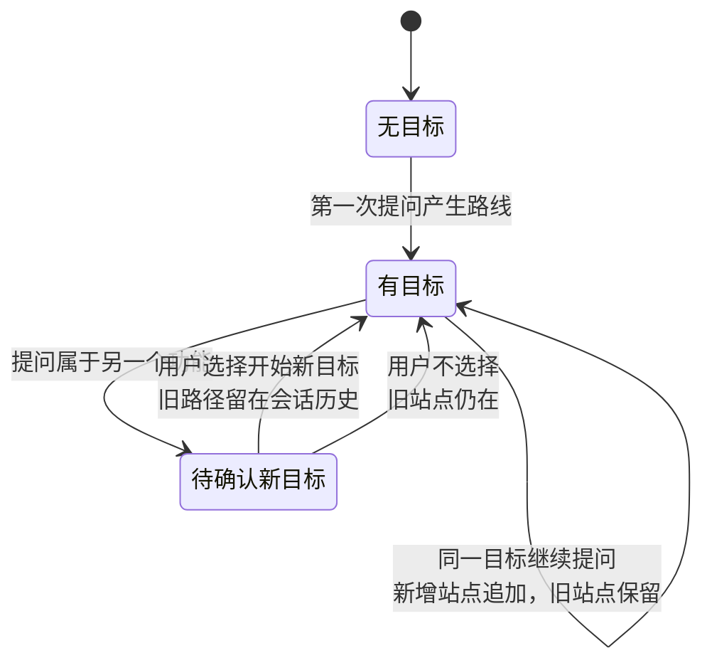
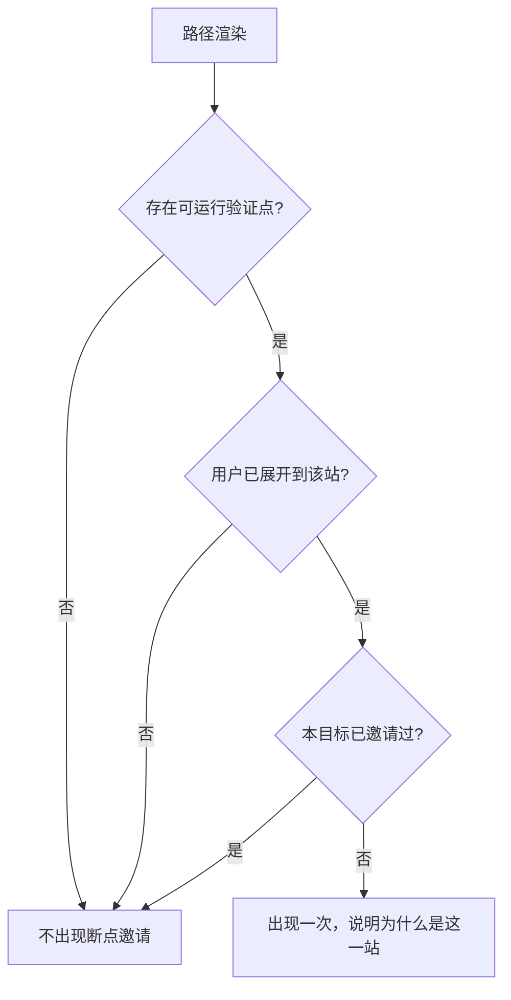
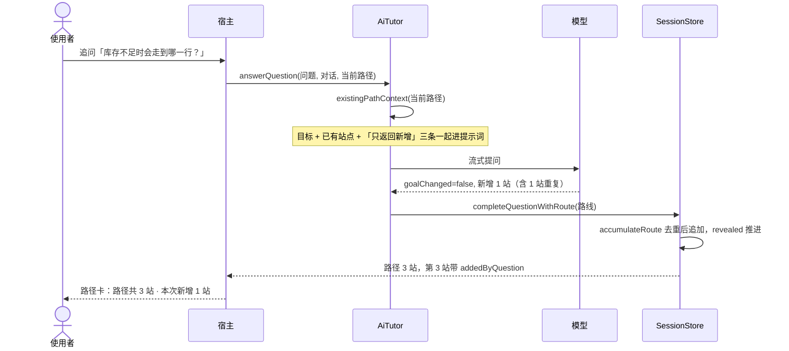
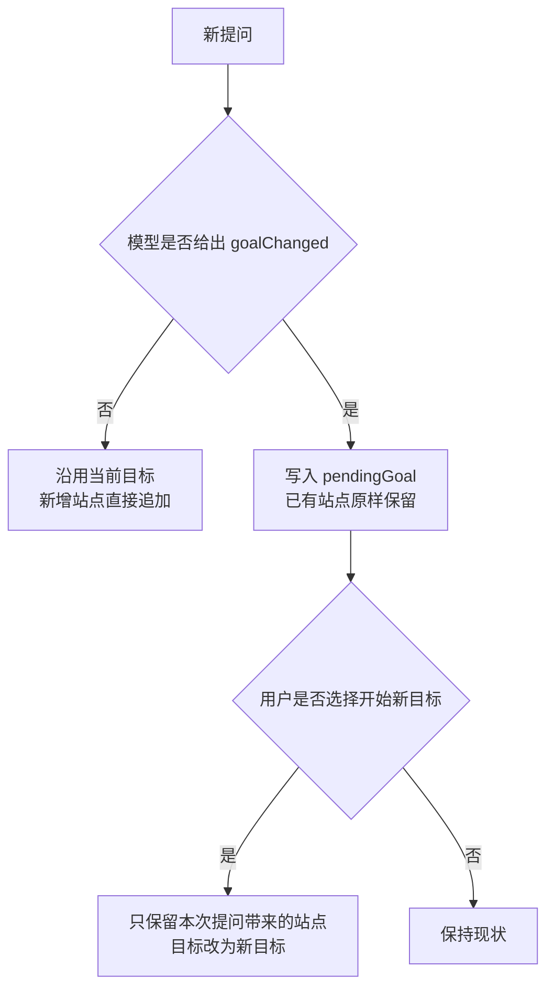

# [feature] 让阅读路径围绕一个探索目标累积 — 连续提问不再丢掉上一条链路

> 状态：已实现。设计按 A（把路线语义改为「围绕探索目标累积」）落地，用户回「请实施」即视为确认；实现结果与本文的差异见「实现完成回填」。
> 基线：`main/eccc3bf`。
> 本文按 issue 结构编写，实现后补全「实现完成回填」并去掉本行。

## 背景与问题

用户在 PyCharm 里用 Code Cat 读一个真实的 TypeScript 项目（`mozi-harness`），连续问了三个层层递进的问题：

1. 「我想了解这个项目的底层原理，从哪里入手比较好？」
2. 「为什么要显示注册呢？那如果有 100 个能力就注册 100 个？」
3. 「这部分代码在哪里？」

三次都得到了回答，但用户的原话是：

> 「用户问一个就来一个断点，上下文其实有关联的。」
> 「我现在对一个问题，整体链路和信息我是不够清楚的，莫名就给了我一个代码起点……无法理解的。」

也就是说：**每次回答都在教，但三次回答之间没有长成一条链路。** 用户看到的永远是「一个新起点 + 一个断点邀请」，看不到自己在整条链路里走到了哪。

### 已核实的机制

| 现象 | 真实原因 | 位置 |
| --- | --- | --- |
| 每次只给一个起点 | 路线产生时把已展开节点数固定为 1，而模型其实被要求给出 2–8 站 | `packages/core/src/core/sessionStore.ts` 的 `applyRoute`；`packages/core/src/ai/aiTutor.ts` 的 `routeInstructions()` |
| 上一条路径消失 | 新路线**整体替换**旧路线，不是追加 | 同上，`applyRoute` 里 `route,` 那一行 |
| 现场证据也一起消失 | 调试结束后 `debugSessionId` 被清空，下一次路线回答的 `preserveDebugSnapshot` 为 false，`pauses` / `selectedPauseId` / `selectedFrameId` 全被清掉 | `sessionStore.ts` 的 `endDebugSession` 与 `applyRoute` |
| 起点被说成「核心」 | 卡片取 `route.nodes[0]`，标题写死「核心代码位置」和「为什么先看这里」 | `packages/ui/src/runtimeMapScript.ts` |
| 每问必打断点 | 只要不是「调试中」也不是「已结束」，断点邀请**无条件**渲染 | 同上，`'想通过断点看看这个过程吗？'` 所在的 else 分支 |
| 组织图只讲本问题 | 文案与投影范围都限定在单次提问 | 同上，「只显示本问题已定位的文件」 |

**一处需要更正的前期判断**：曾怀疑「路线提示词不带对话历史」。核实后不成立——用户走的聊天输入路径是 `AiTutor.answerQuestion`，它带了最近 8 条对话（每条截断 1000 字），提示词里还明确写着 `Use recent conversation to resolve short follow-ups and continue from established understanding. Do not repeat the same overview when the learner asks to go deeper.`。只有显式命令 `codeCat.askProject` 走的 `AiTutor.locateRoute` 不带历史。

所以模型**知道**前面聊过什么，是**路线的产物本身不累积**。这决定了修法：不需要给模型更多上下文，需要改变路线这个对象的生命周期。

### 为什么重要

Code Cat 的定位是「跟着一个问题把代码读通」。如果一次提问只产出一条会被下一条覆盖的假设，那这个定位就不成立——用户拿到的是三次互不相干的讲解，而不是一条能走通的链路。这比检索错误更难发现：每一屏看起来都是对的。

## 期望结果

- 就同一个功能连续提问时，前面得到的站点留在路径上，新站点追加进来，能看出「这次多了哪一站」。
- 用户随时知道这条链路有多长、自己展开到了第几站，不再误以为只有一站。
- 提问明显换了一个功能时，用户可以显式开始新的探索目标；不选择就不静默清空。
- 断点邀请不再每问必现，且出现时说明「为什么是这一站值得打断点」。
- 调试采集到的现场证据不会因为紧接着提了一个新问题就消失。
- 两端（VS Code 与 JetBrains）行为一致。

## 建议行为

### 正常路径

1. 用户第一次提问，产生一条路线。这条路线同时携带一个**探索目标**（一句话描述用户正在理解的那个功能）。
2. 用户就同一目标继续提问。模型收到「当前目标 + 已有站点（位置、标题、职责）」，只输出**本次新增的站点**。
3. 宿主按「文件 + 行」去重后把新站点追加到已有路径尾部；已有站点不动。
4. 新增站点默认展开，用户立刻看到「这次多出来的那一站」；旧站点的展开状态保留。
5. 探索目标显示在路径卡最上方；路径规模以「路径共 N 站 · 本次新增 K 站」给出。

> 实现时的调整：原稿写的是「共 N 站，已展开 M 站」。展开数已经有「代码阅读路径」页头（`已展开 M/N 个关键位置`）和「继续下一处」按钮表达，而累积之后用户最需要知道的是**这次多了哪几站**，因此卡片改为显示新增数，已展开数留在路径页。

### 换目标

用户的新问题与当前目标无关时（例如从「注册机制」跳到「授权校验」），模型在返回里标明这是一个新目标。界面提供「开始新的探索目标」入口：

- 用户选择 → 旧路径作为一个已完成的目标留在会话历史里，当前路径重置为新目标的第一站。
- 用户不选择 → 保持现状，旧站点仍在。

**不允许**静默替换。

### 断点邀请

邀请出现的条件（全部满足）：

1. 当前路径上存在一个**可运行验证点**的站点（该站点是一个可执行语句，会产生可观察的值）；
2. 用户已经展开到该站或选中它；
3. 本次探索目标还没有主动邀请过断点。

措辞要求：说明「为什么是这一站」，例如「第 2 站的 `register()` 会决定 capability 是否进入注册表，在这里暂停可以直接看到它的判定结果」，而不是泛泛的「想通过断点看看这个过程吗？」。按钮保留，但降为次级样式。

> 实现时的落地方式：这三条没有一条能直接读取，因此各自用一个可判定的代理，全部写在 `breakpointInvitationStop` 与 else 分支里。
> - 条件 1 → `confidence !== 'low'`：低置信度站点是模型的猜测，不值得让用户花一次调试去验证；真正的「是不是可执行语句」在 `parseRoute` 已经由 `refinePythonBreakpointLine` 处理过，这里不再重复判断。
> - 条件 2 → 邀请目标取**当前已展开的最后一站**（`route.nodes` 在投影时已按 `revealedRouteNodeCount` 切过）。它一定是用户看得到的位置，也通常是本次新增的落点。
> - 条件 3 → else 分支只在「还没跑过任何一次调试」时进入；一旦跑过，状态就落到「进行中」或「已结束」两个分支，不会再次邀请。

### 边界与失败路径

- 模型返回的站点与已有站点完全重复 → 不追加（按「文件 + 行」去重），路径不变。
- 模型没有返回目标字段 → 沿用当前目标，不重置。
- 模型返回了空的新增站点 → 路径不变，只更新摘要；不报错。
- 项目检索为空 → 沿用现有 `readinessIssue` 分支。
- 会话恢复（重开历史会话）→ 路径与目标一并恢复（两者都在 `RoutePlan` 里，随会话记录持久化）。
- 首条路径上模型误报 `goalChanged` → `accumulateRoute` 在「还没有任何站点」时把 `pendingGoal` 降级为 `goal`，不会出现「第一条路径就让你换目标」。

> 实现时的差异：原稿写「摘要里说明『这一站已经在路径上』」。实际由提示词要求模型只返回新增站点（`Return only the stops this question adds`），去重是宿主的兜底，不会为重复站点额外改写摘要——摘要由模型产出，宿主不代写。
>
> 会话恢复的旧数据回退：原稿写「用第一条路线的提问作为目标」。实际实现是界面回退——`renderExplorationContext` 在 `route.goal` 缺失时显示 `route.question`。`route.question` 是**最近一次**提问而不是第一条，这是已知的近似，旧会话只影响文案，不影响路径本身。

## 范围

**包含**

- `RoutePlan` 增加探索目标字段；路径站点累积合并（core）。
- `applyRoute` 不再整条替换路线，不再把已展开数重置为 1；调试现场证据不再被新提问清空。
- 提示词改为「给出目标 + 本次新增站点」，并把已有站点压缩后带入。
- 共享 UI：路径卡显示总站数与已展开数；新增站点标记；`nodes[0]` 的措辞修正。
- 共享 UI：断点邀请的触发条件与措辞。
- 覆盖上述行为的测试与一个可独立运行的 example。

**不包含**（本阶段明确不做）

- 跨会话的探索目标（历史会话各自独立，不做全局目标）。
- 学习记录模型（结论、依据、未解问题、下次起点）。
- 「代码链路之前需要补充什么背景」的独立数据结构。背景仍由 summary 承担，但本阶段要求 summary 显式衔接已有路径，不再重讲一遍总览。
- 界面分区重排。
- JetBrains 的变量与完整调用栈采集。

第二项与第四项依赖本阶段的路径累积，属于后续阶段。

## 验收标准

实现后逐条核对的结果（落点见下一节的测试策略表）：

1. **给定**一个会话已有一条含 3 站的路径，**当**用户就同一目标继续提问并得到路线回答时，**应**仍能访问那 3 站，且本次新增的站点已追加在路径上。— 已满足（`test/smoke/index.js` 的 `testExplorationContinuity`；真实宿主链路见 `__seedRouteFollowUp` 断言）。
2. **给定**一条已有路径，**当**用户的新问题属于另一个功能时，**应**出现「开始新的探索目标」入口；在用户选择之前，**不得**清空或替换已有站点。— 已满足（同上 + `test/webview/index.cjs` 的 `.goal-change` 断言）。
3. **给定**一条刚产生、用户尚未与路径交互的路线，**当**界面渲染时，**应**不出现断点邀请。— **未按原样实现**。改为「邀请只在本次探索还没跑过调试时出现，且必须指名具体一站」。理由与代理条件见「建议行为 · 断点邀请」。这是本阶段与设计稿最大的一处偏离。
4. **给定**用户已展开到路径中某一站且该站不是低置信度猜测，**当**界面渲染时，**应**出现断点邀请，且文案包含该站的具体位置与「为什么是这一站」。— 已满足（`test/webview/index.cjs` 断言 `想验证第 2 站的实际结果吗` 与次级按钮样式）。
5. **给定**多站的阅读路径，**当**界面渲染核心位置卡时，**不得**使用「核心」这一措辞。— 已满足（标签改为「阅读路径起点」；单站路径仍保留「核心代码位置」，因为那时它确实就是核心位置）。
6. **给定**一条含 N 站、本次新增 K 站的路径，**当**界面渲染时，**应**显示「路径共 N 站 · 本次新增 K 站」；已展开数在「代码阅读路径」页头显示并随展开操作变化。— 已满足（`test/webview/index.cjs` 断言 `路径共 2 站 · 本次新增 1 站`；展开数沿用既有的 `继续下一处` 与页头断言）。
7. **给定**一个调试已结束、已采集到暂停的会话，**当**用户紧接着提出一个路线问题时，**应**仍能访问此前采集的暂停与调用栈。— 已满足（`applyRoute` 不再重置现场证据；`test/smoke/index.js` 里 `setRoute` 之后 `pauses` / `selectedPauseId` / `selectedFrameId` 仍然保留的断言继续通过）。
8. **给定**同一个问题和同一段对话历史，**当**分别在 VS Code 与 JetBrains 宿主执行时，**应**得到一致的路径累积结果。— 已满足（合并逻辑只在 core；两端只投影 `slice(0, revealedRouteNodeCount)`，本阶段未改投影逻辑，只同步了调用点与 `startNewGoal` 消息分支）。

不使用「链路更清晰」「体验更好」这类无法证伪的表述。

## 实现指南

标注为「已观察到」的是本次核对过的现状；标注为「假设」的尚未验证。

**已观察到**

- `packages/core/src/domain/model.ts`：`RoutePlan { question, summary, nodes }`；`RouteNode` 已有 `id/title/symbol/location/reason/role/relation/confidence`；会话状态里有 `route` 与 `revealedRouteNodeCount`。
- `packages/core/src/core/sessionStore.ts` 的 `applyRoute`：整条替换 `route`，`revealedRouteNodeCount` 固定为 `route.nodes.length > 0 ? 1 : 0`，非调试态清空 `pauses`/`selectedPauseId`/`selectedFrameId`。
- `sessionStore.ts` 的 `endDebugSession`：把 `debugSessionId` 置为 undefined，这是上一条清空逻辑的触发源。
- `sessionStore.ts` 的 `revealNextRouteNode` 已经是增量展开，累积后可直接复用。
- `packages/core/src/ai/aiTutor.ts` 的 `answerQuestion`：意图分类 + 路线二合一，带最近 8 条对话。
- `aiTutor.ts` 的 `routeInstructions()`：要求 2–8 站，且 `Do not enumerate or reveal the complete route in the summary`。
- `packages/ui/src/runtimeMapScript.ts`：核心位置卡取 `route.nodes[0]`；断点邀请在 else 分支无条件渲染；组织图文案写「只显示本问题已定位的文件」。
- 两端投影分别在 `src/views/runtimeMapView.ts` 与 `packages/engine/src/main.ts`，都用 `state.route?.nodes.slice(0, state.revealedRouteNodeCount)`。

**假设**

- 把「已有站点」压缩成「路径:行 标题 职责」三列带入提示词，足以让模型判断哪些是新的，不必带全部字段。
- 追加而不是插入中间位置，在真实使用里够用；如果实测发现模型经常需要在中间插站，再考虑插入语义。

**接口变化**

`RoutePlan` 增加可选目标字段：

```ts
interface RoutePlan {
  question: string;
  summary: string;
  nodes: RouteNode[];
  goal?: string;
}
```

`RouteNode` 增加一个标记本次新增的字段：

```ts
interface RouteNode {
  // ...既有字段
  addedByQuestion?: string;
}
```

两者都是可选，旧数据反序列化后行为不变，不构成破坏性变更。

**实现顺序**（每步都可单独验证）

1. core：`RoutePlan` / `RouteNode` 加可选字段，序列化与恢复兼容旧数据。
2. core：`applyRoute` 改为累积合并 + 保留已展开数 + 不再清空现场证据。
3. core：提示词改为「目标 + 本次新增站点」，带入已有站点。
4. 共享 UI：总站数/已展开数、新增标记、`nodes[0]` 措辞。
5. 共享 UI：断点邀请的触发条件与措辞。
6. 补测试断言与 example。

## 实现闭环预案

**目标 example**：`examples/stage-07-exploration-continuity/`

- `user_code/`：通过 `SessionStore` 与 `AiTutor` 的公开入口，用一个返回固定路线的假模型，连续问三个问题，打印每次之后的完整路径与目标，让「路径是否累积」可被直接观察。
- `core/`：指向 `sessionStore.ts` 的 `applyRoute`、`aiTutor.ts` 的提示词构造、`runtimeMapScript.ts` 的路径卡与断点邀请，不复制生产代码。

**最短组装路径**：待实现时确定并回填。预期是 `new SessionStore()` → 注入假 `ModelProvider` 与假 `ProjectContext` → `AiTutor.answerQuestion()` ×3 → 读 `store.snapshot().route.nodes`。

**Example 双层结构**：`user_code/` 只表达使用者意图（问三次、看路径），不出现内部函数名；`core/` 解释为什么路径会累积、累积点在哪。

**关键断点候选**：`applyRoute`（观察 `route.nodes` 是替换还是追加、`revealedRouteNodeCount` 如何变化）、`answerQuestion` 的提示词数组（观察已有站点是否被带入）、路径卡的渲染分支（观察断点邀请是否被条件挡住）。

**验证命令**

```bash
npm run check
npm run test:engine
NODE_PATH=/Users/cyrus/.workbuddy-ai/binaries/node/workspace/node_modules node test/webview/index.cjs
env -u ELECTRON_RUN_AS_NODE SHELL=/bin/sh npm run smoke:vscode
```

最后一条需要非 zsh 默认 shell，原因见 `docs/implementation/stage-05-guided-depth.md` 的「验证环境」一节。本阶段改动 `packages/ui`，因此必须补真实渲染验证与截图。

**完成记录**：本文补全后即为 `docs/implementation/stage-07-exploration-continuity.md`。

**项目导航**：需要同步的入口为 `examples/README.md`（新增阶段索引）、`README.md`、`README.en.md`、`CONTEXT.md`。`AGENTS.md` 只保留稳定规则，不写阶段细节。

**Commit 写法**：沿用仓库既有约定，C1 用 `feat(route): …`（代码、公开 API、example、测试），C2 用 `docs(loop): …`（本文与回填）。

## 测试策略

设计稿把落点写在 `test/engine/index.cjs`，实现时改到了 `test/smoke/index.js`：累积逻辑虽然只在 core，但「换目标」和「首条路径不误报」都依赖真实宿主注入的路线，用 `SessionStore` 直接构造更省事，而且能顺带覆盖 VS Code 宿主的 `__seedRouteFollowUp` / `__startNewGoal` 命令链路。

| 验收标准 | 落点 | 断言 |
| --- | --- | --- |
| 1 路径累积 | `test/smoke/index.js` `testExplorationContinuity` | 重复站点不重复追加、新增站点带 `addedByQuestion`、`revealedRouteNodeCount` 递增 |
| 1 路径累积（真实宿主） | 同上，`__seedRouteGuidance` + `__seedRouteFollowUp` | `route.nodes.length === 3`、第 3 站 `addedByQuestion` 等于追问、第 1 站无标记 |
| 2 换目标不静默清空 | `testExplorationContinuity` | 有 `pendingGoal` 时 `goal` 不变、站点数增加到 3；`startNewGoal()` 后只剩本次提问带来的站点 |
| 2 换目标入口渲染 | `test/webview/index.cjs` | `.goal-change-copy` 文案、点击后发出 `{ type: 'startNewGoal' }`、路径卡仍在 |
| 3/4 断点邀请 | `test/webview/index.cjs` | 邀请文案指名「第 2 站」，按钮带 `quiet`；`test/smoke/index.js` 断言 `想验证第 1 站的实际结果吗` |
| 5 `nodes[0]` 措辞 | `test/webview/index.cjs` | 多站时 `.core-location-label` 等于「阅读路径起点」 |
| 6 路径规模 | `test/webview/index.cjs` | `.exploration-goal-scale` 匹配 `路径共 2 站 · 本次新增 1 站` |
| 7 现场证据不被清空 | `test/smoke/index.js` `testConversationState` | `setRoute` 之后 `debugStatus` 仍为 `paused`、`pauses.length === 1`、`selectedPauseId` / `selectedFrameId` 保留 |
| 8 两端一致 | 累积逻辑只在 core；`packages/engine/src/main.ts` 只新增 `startNewGoal` 分支 | `npm run test:engine` 覆盖引擎协议与投影 |

真实宿主链路（断点、检索、流式回答）由 `npm run smoke:vscode` 覆盖；本阶段改动 `packages/ui`，因此补了真实渲染验证与截图 `.vscode-test/ui/exploration-continuity-360.png`。

**一处需要注意的既有测试耦合**：`test/smoke/index.js` 原先断言路径源码行的 CodeLens 标题是 `Code Cat · 第 1/2 步`。路径累积后同一个位置在 3 站路径上，标题变成 `第 1/3 步`。这不是回归，已随本阶段一起更新。

## 风险与决策

**风险**

- 路径无限增长 → 缓解：同一「文件 + 行」去重；提示词要求只给新增站点；必要时对路径长度设上限并在摘要里说明省略了几站。
- 模型把「新目标」误判为「延续」→ 缓解：提示词要求明确标注；界面允许用户手动开始新目标，不依赖模型判断。
- 累积后摘要变长、重复讲总览 → 缓解：提示词要求 summary 衔接已有路径，不重复已讲过的总览。
- 断点邀请收敛后用户找不到断点入口 → 缓解：入口不删除，降为次级按钮；已展开到站点时仍会主动邀请一次。

**考虑过的替代方案**

- 只改展示层（保留每条提问独立成线，界面上保留「问过哪些文件」）→ 用户描述的痛点核心是「整体链路不清楚」，只改展示层解决不了孤立起点的问题。除非用户明确选这条，否则不采用。
- 每次提问都让模型重新输出完整路径 → 路径会漂移，且 token 成本随路径增长。不采用。
- 把已有站点全量带入提示词 → 与上一条同样的成本问题。改为压缩成三列。不采用全量。
- 把断点邀请完全删掉 → Code Cat 的核心价值是运行证据，删掉会削弱定位。改为条件触发。不采用删除。

**待用户决定**

- ~~A / B 的选择。本文按 A（改路线语义为累积）编写；若选 B，范围与验收标准需重写。~~ 用户回「请实施，并且更新 ide 的插件」，按 A 执行，B 未采用。

**已决定**

- 累积逻辑放在 core 而不是各自宿主实现：两端共用同一份状态模型，避免再次出现「两端各写一份、迟早漂移」。
- 新增字段全部可选：旧会话恢复后行为与现在一致。
- 断点邀请不做「未交互时不出现」（原验收标准 3），改为「还没跑过调试时才出现，且必须指名具体一站」。原因：`route.nodes` 在投影时已经按 `revealedRouteNodeCount` 切过，被邀请的那一站必然是用户看得到的；真正让用户不适的是**泛泛地问**，而不是邀请本身。删掉邀请会削弱「运行证据」这条核心价值，因此保留入口、收敛措辞、降为次级按钮。

## 图表

评审用图（Mermaid 源码，能力等级 D0）：



图名：探索目标与阅读路径的状态变化｜图型：状态图｜阶段：stage-07。

断点邀请的触发条件（图名：断点邀请何时出现｜图型：流程图｜阶段：stage-07）：



draw.io 能力等级：D0（Mermaid 可直接生成）；D1（`.drawio` 文件）未验证；D2/D3/D4 未检测到可用工具。本机没有 `~/.workbuddy-ai/mcp.json`，未探测到 draw.io MCP、浏览器画布控制或 Desktop live 通道，因此不声称已连接。需要正式编辑时手工导入 diagrams.net。

## 实现完成回填

### 实际 example 与最短启动命令

```bash
node examples/stage-07-exploration-continuity/user_code/main.cjs
```

不需要安装任何 IDE、不需要模型凭据。`SessionStore` 与 `AiTutor` 都是 `packages/core` 的公开入口，`ProjectContext` 与 `ModelGateway` 在示例里用内存实现。

### `user_code/` 的公开调用、输入与输出

`user_code/main.cjs` 只做两件事：连问三个问题，然后读 `store.snapshot().route`。三个问题的固定回答依次是「同一目标的第一批站点」「同一目标、重复了一站 + 新增一站」「换了目标」。

实际输出：

```text
提问：结账时库存是怎么预留的？

第一次提问之后
  探索目标：结账如何预留库存
  待确认的新目标：(无)
  路径共 2 站：
  1. checkout.py:2 结账入口
  2. inventory.py:3 库存预留

提问：那库存不足时会走到哪一行？

第二次提问之后（同一目标，路径变长）
  探索目标：结账如何预留库存
  路径共 3 站：
  1. checkout.py:2 结账入口
  2. inventory.py:3 库存预留
  3. checkout.py:4 库存不足的分支 [新增 · 来自「那库存不足时会走到哪一行？」]

  第二次提问的提示词带上了当前目标：true
  第二次提问的提示词列出了已有站点：true
  第二次提问的提示词要求只返回新增：true

提问：那支付扣款是在哪里发生的？

第三次提问之后（换了目标，但还没确认）
  探索目标：结账如何预留库存
  待确认的新目标：支付扣款如何发生
  路径共 4 站
  ...

用户选择「开始新的探索目标」：true

确认新目标之后
  探索目标：支付扣款如何发生
  路径共 1 站：
  1. payment.py:2 扣款调用 [新增 · 来自「那支付扣款是在哪里发生的？」]
```

第二次提问的固定回答里故意把 `inventory.py:3` 又给了一遍，它没有出现在第 3 位——这一行就是「按文件 + 行去重」的直接证据。三次 `true` 说明「路径为什么不会漂移」发生在提示词里：目标、已有站点、只返回新增，三条指令都真的进了提示词。

### `core/` 的核心代码映射

| 观察到的行为 | 真实实现 |
| --- | --- |
| 路径累积与去重 | `packages/core/src/core/sessionStore.ts::accumulateRoute`，由 `applyRoute` 调用 |
| 站点身份 | `packages/core/src/core/sessionStore.ts::routeNodeKey`（`文件:行`） |
| 已展开数推进 | `accumulateRoute` 的 `Math.min(nodes.length, Math.max(1, currentRevealed) + added.length)` |
| 目标与待确认目标 | `packages/core/src/ai/aiTutor.ts::parseRoute` 的 `goal` / `pendingGoal` 分流；`sessionStore.ts::accumulateRoute` 决定保留哪个 |
| 换目标收敛 | `packages/core/src/core/sessionStore.ts::startNewGoal` |
| 提示词带入已有站点 | `packages/core/src/ai/aiTutor.ts::existingPathContext`，由 `answerQuestion` / `locateRoute` 调用 |
| 路径规模与新增标记 | `packages/ui/src/runtimeMapScript.ts::pathScaleLabel`、`pathNode` 的 `.path-new` |
| 起点措辞 | `packages/ui/src/runtimeMapScript.ts::renderExplorationContext` |
| 断点邀请收敛 | `packages/ui/src/runtimeMapScript.ts::breakpointInvitationStop` 与 `renderExplorationContext` 的 else 分支 |

改动落在 12 个已跟踪文件 + 4 个新增路径（`docs/implementation/stage-07-exploration-continuity.md`、`scripts/publish-jetbrains.py`、`examples/stage-07-exploration-continuity/`、`plugins/jetbrains/MARKETPLACE.md` 为新增或重写）。

### 实际断点与观察变量

| 断点 | 稳定定位 | 观察变量 | 预期变化 |
| --- | --- | --- | --- |
| 路径是追加还是替换 | `sessionStore.ts::accumulateRoute` | `existing`、`added`、`nodes`、`revealedRouteNodeCount` | 第二次提问：`added` 只含 1 站（重复站被 `seen` 过滤），`nodes` 由 2 变 3 |
| 目标怎么被保留 | 同上 | `incoming.goal`、`incoming.pendingGoal`、`current?.goal` | 无 goal 的追问 → `goal` 不变；`pendingGoal` 非空 → `goal` 也不变 |
| 首条路径的降级 | 同上，`existing.length === 0` 分支 | `incoming.pendingGoal` | 被改写成 `goal`，`pendingGoal` 置空 |
| 提示词是否带上下文 | `aiTutor.ts::existingPathContext` | 返回值 | 有路径时含 `Current exploration goal:` 与 `Stops already on the reading path`；无路径时为空串 |
| 断点邀请指向哪一站 | `runtimeMapScript.ts::breakpointInvitationStop` | `nodes`、循环下标 | 从最后一站往前找，跳过 `confidence === 'low'` |

行号只作为当前基线参考，定位以文件 + 符号为准。

### 实际执行过的验证命令与结果

```bash
npm run check
# > code-cat@0.2.5 check
# > tsc -p packages/core/tsconfig.json && tsc -p packages/ui/tsconfig.json && tsc -p packages/engine/tsconfig.json --noEmit && tsc -p tsconfig.json --noEmit
# Exit code: 0

npm run test:engine
# 共享会话核心可脱离 IDE 运行；问答完成后可以继续提问。
# Engine passed: streaming, pause projection, live-only controls, traversal rejection, cancellation, Chinese retrieval expansion (2) and persistence without credentials.
# Retrieval passed: local package identity, exact declaration before 8 examples, body beyond line 160, partial coverage notice, Chinese-only question reaching the relevant file through expanded terms.
# Exit code: 0

NODE_PATH=/Users/cyrus/.workbuddy-ai/binaries/node/workspace/node_modules node test/webview/index.cjs
# Webview behavior, theme overrides, contrast and 6 visual captures passed: /Users/cyrus/work/my/code-cat/.vscode-test/ui
# Exit code: 0

env -u ELECTRON_RUN_AS_NODE SHELL=/bin/sh npm run smoke:vscode
# Code Cat Node smoke passed: JS/TS indexing, source resolution, JS automatic launch, TS source-map breakpoint, captured evidence.
# Code Cat smoke passed: model adapters, activation, linked breakpoint, debug snapshots, both views, and duplicate-control suppression.
# Code Cat entrypoint smoke passed: pyproject console script reached its breakpoint.
# smoke exit=0

node examples/stage-07-exploration-continuity/user_code/main.cjs
# 见上文输出，Exit code: 0

git diff --check
# 无输出
```

**冒烟的三次失败与判据**：本轮冒烟共跑四次，前三次分别失败在 `test/smoke/index.js:399`、`:93`、`:196`，第四次全绿。逐条判据如下。

- `:399` 是**真实影响**：路径源码行的 CodeLens 标题从 `第 1/2 步` 变成 `第 1/3 步`，因为路径累积后同一个位置在更长的路径上。已按新行为更新断言。
- `:93`（`Enter 发送` 快捷键文案读到空串）与 `:196`（聊天富文本元素数为 0）都是**诊断快照时序**：这两处读的 `renderedDiagnostics` 只在 `lastReceivedVersion === stateVersion` 时被替换，宿主侧的 `waitForValue` 谓词没有检查这一点。两处断言在本轮未触碰的代码路径上（`packages/ui` 的 composer 与聊天富文本渲染），且 `:93` 在更早一次运行中通过，重跑全绿。判为宿主时序风险，与 `stage-05`、`stage-06` 记录的同类先例一致，本轮不改动测试。

### 实现 commit 与记录 commit

- 记录语言：中文
- 实现 commit（C1）：`f49fef63127d6acd31de26acf5acc90ccfa4af73`，分支 `main`，标题 `feat(route): 阅读路径围绕一个探索目标累积`，18 files changed, 791 insertions(+), 44 deletions(-)
- 发版 commit（C0，与本阶段同批但主题不同）：`7bdc052`，标题 `chore(release): 增加 Marketplace 上传脚本并同步发版文档`
- 记录 commit（C2）：分支 `main`，标题 `docs(loop): 记录 stage-07 的实现与验证证据`。完整 SHA 在提交后由最终回复给出——记录不引用自身 SHA。

C1 固化 core 的累积语义、两端宿主调用点、共享 UI、测试、example 与项目导航；C2 固化本文与回填。`RoutePlan` / `RouteNode` 的新字段都是可选的，因此 C1 不构成破坏性变更。

### 互链

- example 入口：`examples/stage-07-exploration-continuity/README.md`
- 示例索引：`examples/README.md`
- 项目导航：`CONTEXT.md` 的「Stage 07 · 探索连续」与 Language 段的 `Reading path` / `Exploration goal`、`README.md` / `README.en.md` 的累积说明
- 渲染截图：`.vscode-test/ui/exploration-continuity-360.png`（构建产物，不入库）

### 本阶段明确未做

- 路径长度上限。设计稿把「路径无限增长」列为风险，缓解手段目前只有去重与提示词约束；真实长会话下是否需要在摘要里说明「省略了几站」尚未验证。
- 站点插入到中间位置。只做尾部追加；若实测发现模型经常需要在中间插站，再考虑插入语义。
- JetBrains 侧的界面截图。两端共用 `packages/ui`，JetBrains 通过同一份 HTML 渲染，但本阶段只截了 VS Code 宿主的图。
- 真实模型下的目标判断质量。example 与测试用手写 `goalChanged` 复现路径，没有统计模型在真实追问上误报「换目标」的频率。

---

## 阶段完成卡：stage-07 · 探索连续

### 完成结果

同一个探索目标下的连续提问共用一条阅读路径：只追加本次新增的站点，保留已读过的位置与展开状态，回答接着已有链路说。模型认为换了功能时只提示并给出口，不静默替换路径，也不清掉已采集的运行证据。

### 真实 example

输入：三个层层递进的提问（「结账时库存是怎么预留的？」→「那库存不足时会走到哪一行？」→「那支付扣款是在哪里发生的？」），以及一个三文件的临时项目。

输出：路径 2 站 → 3 站（重复站未重复追加）→ 4 站 + 待确认新目标；确认新目标后收敛为 1 站。

路径：`examples/stage-07-exploration-continuity/user_code/main.cjs`
命令：`node examples/stage-07-exploration-continuity/user_code/main.cjs`

### Example 双层结构

- **user_code 主线**：`examples/stage-07-exploration-continuity/user_code/main.cjs`。只调 `SessionStore` 与 `AiTutor` 的公开入口，打印每次提问后的完整路径、目标与新增标记。不出现内部函数名。
- **core 核心代码**：`sessionStore.ts::accumulateRoute` / `startNewGoal`、`aiTutor.ts::existingPathContext` / `parseRoute`、`runtimeMapScript.ts::pathScaleLabel` / `breakpointInvitationStop`。对应 C1。
- **清爽度结论**：user_code 表达的是使用者意图（问三次、看路径怎么长），不出现 `accumulateRoute`、`routeNodeKey` 这些内部名字；提示词断言只引用提示词里真实存在的英文句子，不引用内部变量。

### 关键路径图

同一目标下的追问如何累积（图名：同一目标下追问的路径累积｜图型：UML 时序图｜阶段：stage-07）：



换目标的判断（图名：换目标何时收敛｜图型：流程图｜阶段：stage-07）：



### 关键路径断点

1. **断点：路径是追加还是替换** — `sessionStore.ts::accumulateRoute`。观察 `added` 的长度与 `nodes` 的增长；`seen` 集合是去重的实现。验证：example 第二次提问后路径为 3 站。
2. **断点：提示词有没有带上下文** — `aiTutor.ts::existingPathContext`。观察返回值；没有路径时必须是空串（首问行为不变）。验证：example 打印的三个 `true`。
3. **断点：目标在哪一步被改写** — `parseRoute` 把 `goalChanged` 分流成 `goal` / `pendingGoal`，`accumulateRoute` 决定保留谁。验证：`test/smoke/index.js::testExplorationContinuity`。
4. **断点：邀请指向哪一站** — `runtimeMapScript.ts::breakpointInvitationStop`。观察循环从哪一站开始、跳过哪些站。验证：`test/webview/index.cjs` 断言「想验证第 2 站的实际结果吗？」。

### 验证证据

见上文「实际执行过的验证命令与结果」。四组命令全部 Exit 0：`npm run check`、`npm run test:engine`、`node test/webview/index.cjs`、`env -u ELECTRON_RUN_AS_NODE SHELL=/bin/sh npm run smoke:vscode`。

### 项目导航

- Example 总索引：`examples/README.md`（新增 stage-07 索引行）
- 项目 README：`README.md` 与 `README.en.md` 的阅读路径累积段落
- Context：`CONTEXT.md` 新增「## Stage 07 · 探索连续」，并在 Language 段补充 `Reading path` 与 `Exploration goal`
- AGENTS / 等价 agents 文件：未变化。`AGENTS.md` 只保留稳定工作规则，不写阶段细节

### draw.io 状态

能力等级 D0（Mermaid 源码可直接生成）。本机没有 `~/.workbuddy-ai/mcp.json`，未探测到 draw.io MCP、浏览器画布控制或 Desktop live 通道，因此不声称已连接或已驱动 draw.io。需要正式编辑时把上面两张 Mermaid 图导入 diagrams.net。

### 可回放说明

1. 取 C1（代码、测试、example、导航）与 C2（本文与回填）。
2. 先读 `examples/stage-07-exploration-continuity/README.md`，再读其中的 `user_code/README.md`。
3. 跑 `node examples/stage-07-exploration-continuity/user_code/main.cjs`，确认路径从 2 站长到 3 站、重复站没有出现在第 3 位、三次提示词断言都是 `true`。
4. 按上文断点顺序在四处暂停，观察 `added`、`existingPathContext` 的返回值、`goal` / `pendingGoal` 与邀请目标。
5. 需要完整链路时跑 `env -u ELECTRON_RUN_AS_NODE SHELL=/bin/sh npm run smoke:vscode`。
