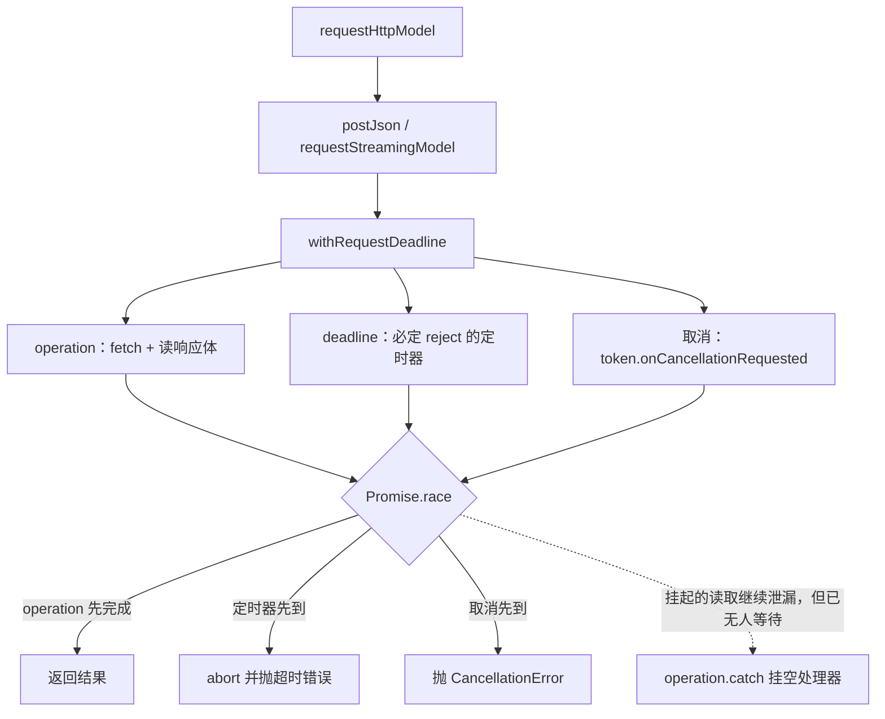
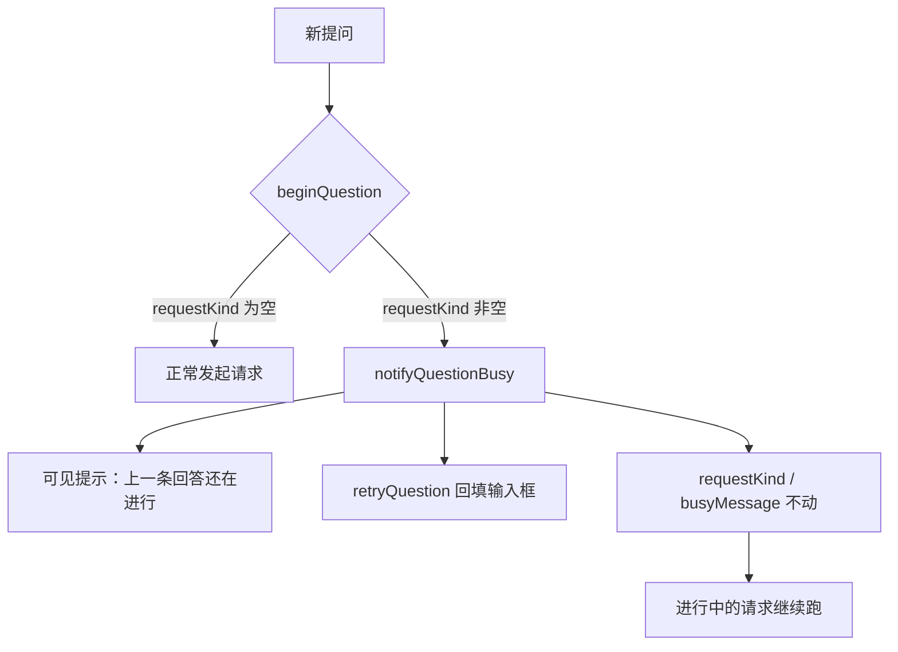

# [fix] 让模型请求一定会 settle — 卡在「正在思考」不再永不返回

> 状态：已实现。本文由一次用户报障驱动，不是路线图上的功能阶段；沿用本仓库唯一的实现记录通道 `docs/implementation/stage-NN-<slug>.md`，编号顺延为 stage-08。
> 基线：`main/b02cc1f`。

## 背景与问题

用户在 PyCharm 里提问后，Code Cat 面板停在「正在思考」，等了几分钟也没有任何回复，也没有报错。用户的第一反应是怀疑凭据：

> 「咋回事，不回复了，是使用火山引擎的key吗」

排查结论是**与 key 无关**，真实原因是请求永远不会 settle。

### 关键证据：不是 key

| 场景 | 观察结果 |
| --- | --- |
| 不配置模型 | 4.5 s 出现可见错误「请先在"更多"中配置模型。」 |
| 配置一个假 key | 5.3 s 出现可见错误 `Model provider request failed (401): The API key format is incorrect.` |
| 直连 `ark.cn-beijing.volces.com` | 0.14 s 返回 401 |
| 报障时的引擎进程（PID 43101） | 存活且**完全空闲**：主线程停在 `kevent`，`lsof` 看不到任何网络套接字，状态文件 26 分钟没变 |

也就是说：请求在发出之前就失败了会立刻报错；key 有问题也会在 5 秒内报错。卡住的那一次，请求**已经发出去了**，只是永远等不到结果。

### 已核实的机制

| 现象 | 真实原因 | 位置 |
| --- | --- | --- |
| 超时完全不生效 | 超时只做了 `setTimeout(() => controller.abort(), timeoutMs)`，而当服务端已经返回响应头、响应体迟迟不来时，`abort()` 不会让挂起的 `for await (const chunk of response.body)` 抛错，外层 Promise 永不 settle | `packages/core/src/ai/modelClients.ts` 的 `postJson` 与 `requestStreamingModel` |
| 阈值行为 | 实测：`redirect: "error"` 时 `timeoutMs ≤ 8000` 能正常抛出，`≥ 8192` 永久悬挂。产品用的是 `REQUEST_TIMEOUT_MS = 90_000`，所以**必然**走到坏的那一侧 | 同上 |
| 新提问被静默丢弃 | `beginQuestion` 在 `requestKind` 非空时返回 `undefined`，两个宿主都直接 `return`，用户看不到任何反馈 | `packages/engine/src/main.ts::ask`、`src/extension.ts::askQuestion` |
| 「停止回答」看起来正常 | 宿主自己用 `Promise.race` 竞争了取消事件，所以 UI 能恢复；但底层请求仍在泄漏套接字 | `src/extension.ts::cancellable`、`engine/main.ts::ask` 的 race |

阈值是二分出来的：2000 / 4000 / 5000 / 6000 / 8000 正常抛出，8192 / 9000 / 9500 / 12000 / 15000 / 30000 / 90000 全部悬挂，用裸 TCP 服务端复现同样成立，说明问题不在 Node 的 HTTP 服务端实现上。

### 为什么重要

这不是「慢」，是**不返回**。用户无法区分「模型在思考」和「已经坏了」，只能重启 IDE。而且 `requestKind` 会一直停在 `question`，后续提问全部被丢弃——一次坏响应就等于这个会话废了。

## 期望结果

- 模型请求无论底层表现如何，Promise 一定会 settle：要么拿到结果，要么抛出超时错误。
- 服务端返回了响应头却一直不发正文时，超时必须在约定时间生效，不依赖 `abort()` 是否能打断挂起的读取。
- 超时与取消都不能只靠 `abort()`。
- Base URL 指向了会重定向的地址时，明确报错，且不把凭据转发到重定向目标。
- 上一条回答还没结束时又提问：给出可见提示，把没发出去的提问放回输入框，不打断进行中的请求。
- 两端（VS Code 与 JetBrains）行为一致。

## 范围

- 改：`packages/core/src/ai/modelClients.ts`、`packages/core/src/core/sessionStore.ts`、`packages/core/src/domain/model.ts`、`packages/engine/src/main.ts`、`src/extension.ts`、`packages/ui/src/runtimeMapScript.ts`。
- 加：`test/engine/timeout.cjs`（回归测试）。
- 不改：提示词、检索、路线语义、调试采集。

## 验收标准

1. 服务端只回响应头、不回正文时，非流式与流式请求都按 `timeoutMs` 抛出超时错误。
2. 同一场景下取消请求，立刻抛出 `CancellationError`，不等超时。
3. 302 响应被拒绝，错误里说明是重定向，且重定向目标收不到任何请求。
4. 请求进行中再次提问：出现「上一条回答还在进行」的可见提示，输入框保留这次没发出去的提问，进行中的请求不被清掉。
5. 上述四条各有断言，且**退回旧实现时断言会失败**。

## 关键路径图

超时如何变得必定生效（图名：超时与取消的竞争结构｜图型：流程图｜阶段：stage-08）：



重复提问为什么不再静默丢弃（图名：进行中再次提问的分流｜图型：流程图｜阶段：stage-08）：



## 实现完成回填

### 实际代码映射

| 观察到的行为 | 真实实现 |
| --- | --- |
| 超时必定生效 | `packages/core/src/ai/modelClients.ts::withRequestDeadline`，由 `postJson` 与 `requestStreamingModel` 调用 |
| 取消必定生效 | 同上，`withRequestDeadline` 的第三个竞争者来自 `token.onCancellationRequested` |
| 不跟随重定向、也不失去可中断性 | 同上，`redirectRejection` + `fetch` 的 `redirect: "manual"`（替换原来的 `"error"`） |
| 超时错误文案 | 同上，`The model provider request timed out after N ms.` |
| 重复提问的可见提示 | `packages/core/src/domain/model.ts` 新增 `TutorMessage` 的 `busy` 分支；`packages/core/src/core/sessionStore.ts::notifyQuestionBusy` |
| 两个宿主的接入点 | `packages/engine/src/main.ts::ask` 与 `src/extension.ts::askQuestion`，都在 `beginQuestion` 返回 `undefined` 时改调 `notifyQuestionBusy` |
| 提示怎么渲染 | `packages/ui/src/runtimeMapScript.ts::renderTutorMessage` 增加 `busy` 分支（标题「上一条回答还在进行」、副标题指向「停止回答」、class 加 `.busy`），`renderOverview` 的渲染门槛加入 `busy` |

改动落在 9 个已跟踪文件 + 1 个新增文件（`test/engine/timeout.cjs`），共 187 插入 / 55 删除（不含本文）。

### 实际断点与观察变量

| 断点 | 稳定定位 | 观察变量 | 预期变化 |
| --- | --- | --- | --- |
| 超时是否真的与请求竞争 | `modelClients.ts::withRequestDeadline` | `racers.length`、`timer` | 带 token 时 `racers` 长度为 3；`finally` 里 `timer` 被清掉 |
| 挂起的读取有没有被放弃 | 同上，`operation.catch(() => undefined)` | 是否产生 unhandledRejection | 超时后不再有未处理的 rejection |
| 旧实现与新实现的差别 | `modelClients.ts::postJson` 的 `fetch` 调用 | `redirect` 的值 | `manual`（旧实现为 `error`） |
| 重复提问走了哪条分支 | `sessionStore.ts::beginQuestion` | 返回值 | 进行中返回 `undefined`，随后 `notifyQuestionBusy` 命中 |
| 提示有没有污染进行中的请求 | `sessionStore.ts::notifyQuestionBusy` | `requestKind`、`busyMessage` | 两者都不变；只有 `tutorMessage` 与 `retryQuestion` 被写 |

行号只作为当前基线参考，定位以文件 + 符号为准。

### 实际执行过的验证命令与结果

```bash
npm run check
# > code-cat@0.2.7 check
# > tsc -p packages/core/tsconfig.json && tsc -p packages/ui/tsconfig.json && tsc -p packages/engine/tsconfig.json --noEmit && tsc -p tsconfig.json --noEmit
# Exit code: 0

npm run test:engine
# 共享会话核心可脱离 IDE 运行；问答完成后可以继续提问。
# Engine passed: streaming, pause projection, live-only controls, traversal rejection, busy question notice, cancellation, Chinese retrieval expansion (2) and persistence without credentials.
# Retrieval passed: local package identity, exact declaration before 8 examples, body beyond line 160, partial coverage notice, Chinese-only question reaching the relevant file through expanded terms.
# Timeout passed: 正文挂住的非流式与流式请求都按超时失败（12000 ms，覆盖旧实现永久悬挂的区间），取消在挂住时也能立即 settle，302 被拒绝且凭据未转发到重定向目标。
# Exit code: 0

NODE_PATH=/Users/cyrus/.workbuddy-ai/binaries/node/workspace/node_modules node test/webview/index.cjs
# Webview behavior, theme overrides, contrast and 7 visual captures passed: /Users/cyrus/work/my/code-cat/.vscode-test/ui
# Exit code: 0

env -u ELECTRON_RUN_AS_NODE SHELL=/bin/sh npm run smoke:vscode
# Code Cat Node smoke passed: JS/TS indexing, source resolution, JS automatic launch, TS source-map breakpoint, captured evidence.
# Code Cat smoke passed: model adapters, activation, linked breakpoint, debug snapshots, both views, and duplicate-control suppression.
# Code Cat entrypoint smoke passed: pyproject console script reached its breakpoint.
# smoke exit=0
```

新增的 `test/engine/timeout.cjs` 用裸 TCP 服务端只回响应头、不回正文，超时取 12000 ms（**刻意落在旧实现永久悬挂的区间里**），四个场景各自断言：非流式、流式、取消、302。整支跑 24.5 s。

按产品真实超时值复验，用报障时同一份复现脚本指向仓库构建产物：

```bash
node /tmp/cc-stall-repro-fixed.mjs 90000
# timeoutMs=90000 => 正常抛出（用时 90.04s）：The model provider request timed out after 90000 ms.
# exit=0
```

### 回归测试的负向验证

一个抓不住旧 bug 的回归测试没有价值，所以两支新断言都做了负向验证。

**超时**：把 `packages/core/dist/ai/modelClients.js` 复制到 `/tmp/cc-oldcheck/`，把 `withRequestDeadline` 换回「只有一个 `abort()` 定时器」的旧实现，并把 `redirect: "manual"` 换回 `"error"`，再用同一支测试跑：

```text
AssertionError [ERR_ASSERTION]: 非流式：正文一直不来：WATCHDOG: 请求在 20000 ms 内没有 settle，又退回了「永久悬挂」
# exit=1
```

**重复提问提示**：从 `packages/engine/dist/main.js` 里删掉 `store.notifyQuestionBusy(question);`（即恢复静默返回），同一支引擎测试在 7 s 后超时：

```text
Error: Timed out: [... chatMessages 里没有「第二条提问」，也没有 tutorMessage ...]
# exit=1
```

两次负向验证之后都重新 `npm run compile` 复跑，均为 Exit 0。

### 本阶段明确未做

- **JetBrains 侧的界面截图**。两端共用 `packages/ui`，但本次只截了 VS Code 宿主的图。
- **`redirect: "manual"` 是否在所有 provider 上都必要**。它是缓解手段（让 `abort()` 恢复可中断性），真正兜底的是 `withRequestDeadline`。没有逐个 provider 复测。
- **泄漏套接字的回收**。超时或取消之后，底层挂起的读取仍会持有套接字，直到服务端关闭或连接超时。本轮只保证调用方不再等待，没有主动销毁连接。
### 发版与安装

用户确认「升版本 + 装三个 IDE + 提交推送」，因此本轮同时发版。

| 目标 | 版本 | 产物 | 安装结果 |
| --- | --- | --- | --- |
| VS Code | `0.2.6` → `0.2.7` | `code-cat-0.2.7.vsix`（117 文件，206.97 KB） | `local.code-cat@0.2.7` |
| WebStorm 2025.1 | `0.2.9-preview` → `0.2.10-preview` | `code-cat-jetbrains-0.2.10-preview-webstorm-251.zip`（48 文件） | `since-build 251`，含 `<depends>NodeJS</depends>` |
| PyCharm 2026.1 | 同上 | `code-cat-jetbrains-0.2.10-preview-pycharm-261.zip`（48 文件） | `since-build 261`，不声明 `NodeJS` |

安装后逐个读回产物核对，确认修好的代码真的在包里：VS Code 的 `packages/core/dist/ai/modelClients.js` 含 `withRequestDeadline` 与 `redirect: "manual"`，`dist/extension.js` 含 `notifyQuestionBusy`，`packages/ui/dist/runtimeMapScript.js` 含新提示文案；两个 JetBrains 包的 `lib/code-cat.jar` 里 `codecat.html` 同样含新提示，`META-INF/plugin.xml` 的 `<version>` 为 `0.2.10-preview`。旧插件目录移到各产品目录下的 `code-cat-backup-<时间戳>`（`plugins/` 之外），避免被当成重复插件加载。

### 互链

- 回归测试：`test/engine/timeout.cjs`
- 渲染截图：`.vscode-test/ui/busy-question-notice-360.png`（构建产物，不入库）
- 报障时的复现脚本：`/tmp/cc-stall-repro.mjs`（指向已安装插件）与 `/tmp/cc-stall-repro-fixed.mjs`（指向仓库构建），都是临时脚本，不入库
- 相关阶段：`docs/implementation/stage-04.md`（模型客户端与两端共享核心的来源）、`docs/implementation/stage-07-exploration-continuity.md`（本 bug 是在该轮验证中由用户发现的）
