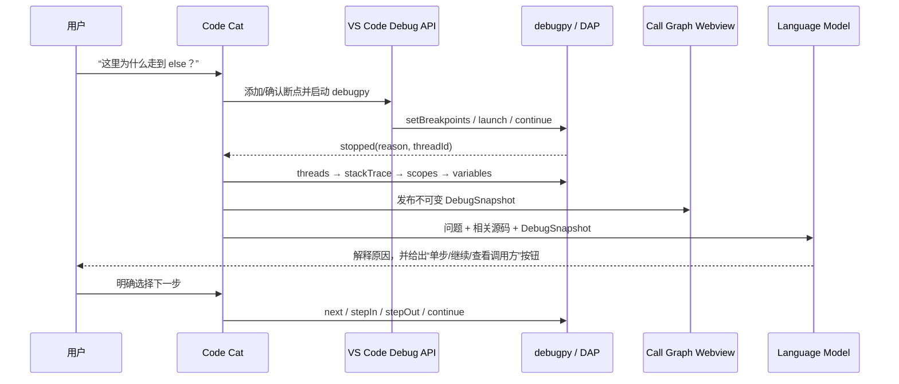

# Code Cat 可复用能力调研：Python × VS Code × AI Debug

> 调研日期：2026-07-23
> 范围：只考虑 Python 项目、VS Code Extension、可公开使用的稳定 API 和可审计的开源组件。优先引用官方文档、协议和源码仓库。

## 结论先行

这四个目标不需要从零实现。可直接复用的主干是：

1. **项目理解与问题定位**：复用 VS Code 已注册的语言服务，通过内置命令获取 symbol、definition、references 和 call hierarchy；用 Pyright/Pylance 作为 Python 语义提供者，用 ripgrep 和 Tree-sitter 补足全文检索与结构化分块。
2. **断点与问答融合**：复用 VS Code Debug API 管理会话和断点，用 `DebugAdapterTracker` 观察 DAP 消息；复用 debugpy 运行 Python。问答界面可接入 Chat Participant API，或在自有 Webview 中实现聊天。
3. **调用栈**：按照 DAP 的 `stopped → threads → stackTrace → scopes → variables/evaluate` 获取完整暂停态。VS Code 已提供当前 frame 变化事件，但“全栈和变量”仍应按 DAP 主动获取并保存快照。
4. **思维导图联动**：复用 Webview 双向消息和 React Flow；由我们自己维护“源码节点—断点—运行时 frame—问答证据”的领域模型。不要自研画布，也不要把 Mermaid 当作交互主画布。

推荐的首版依赖组合：

| 层 | 首选 | 复用方式 | 许可证/约束 |
|---|---|---|---|
| Python 语言语义 | VS Code 的公开 `vscode.execute*Provider` / Call Hierarchy 命令，消费当前已安装语言服务 | 直接调用稳定 Extension API | VS Code 源码 MIT；语言 provider 可能来自 Pylance 或其他扩展，**不复制其实现** |
| Python 语义兜底 | Pyright | 后期可选；仅在没有可用 provider 时启动独立 language server | MIT；会增加第二套索引、内存和 LSP client 成本（[Pyright LICENSE](https://github.com/microsoft/pyright/blob/main/LICENSE.txt)） |
| 结构解析 | `web-tree-sitter` + `tree-sitter-python` | WASM 解析 Python，生成函数/类/import 节点和代码块 | MIT（[Tree-sitter LICENSE](https://github.com/tree-sitter/tree-sitter/blob/master/LICENSE)、[Python grammar LICENSE](https://github.com/tree-sitter/tree-sitter-python/blob/master/LICENSE)） |
| 文本搜索 | `@vscode/ripgrep` | 扩展宿主启动 `rg`，做低延迟候选召回 | MIT；官方包已包含各平台预编译二进制且运行时无需下载（[官方 README](https://github.com/microsoft/vscode-ripgrep#readme)、[LICENSE](https://github.com/microsoft/vscode-ripgrep/blob/main/LICENSE)） |
| Python Debug | `ms-python.debugpy` / `debugpy` | 启动 `type: "debugpy"` 的会话；不自研 Debug Adapter | MIT（[Python Debugger 扩展](https://github.com/microsoft/vscode-python-debugger)、[debugpy](https://github.com/microsoft/debugpy)） |
| 调试协议 | DAP + VS Code Debug API | 捕获停止事件、读取栈/作用域/变量、控制 step/continue | DAP 实现代码 MIT（[License-code.txt](https://github.com/microsoft/debug-adapter-protocol/blob/main/License-code.txt)）；规范见[官方 specification](https://microsoft.github.io/debug-adapter-protocol/specification) |
| AI 对话 | Chat Participant + Language Model API，外加自有 provider 适配层 | 优先使用用户在 Chat 中选择的模型；无模型时允许 BYOK/禁用 AI | 模型可能为空，需要用户同意，存在 quota/token 限制（[官方 Language Model 指南](https://code.visualstudio.com/api/extension-guides/language-model)） |
| AI 工具 | Language Model Tool API | 注册只读工具和受控的调试控制工具 | 工具可由 agent 自动选择；高风险动作可选配 invocation confirmation（[官方 Tool 指南](https://code.visualstudio.com/api/extension-guides/tools)） |
| 图形交互 | `@xyflow/react` + `@dagrejs/dagre` | Webview 内渲染交互图；Dagre 负责层次布局 | 两者 MIT（[XYFlow LICENSE](https://github.com/xyflow/xyflow/blob/main/LICENSE)、[Dagre LICENSE](https://github.com/dagrejs/dagre/blob/master/LICENSE)） |

## 1. 更快让 AI 理解项目，并从问题定位整体代码链路

### 1.1 不让模型“读完整仓库”，而是给模型一组确定性代码导航工具

VS Code 已经把各种语言服务统一成公开命令。可以直接调用：

- `vscode.executeDocumentSymbolProvider`：当前文件的类、函数、方法层次；
- `vscode.executeWorkspaceSymbolProvider`：按名称检索整个工作区的 symbol；
- `vscode.executeDefinitionProvider`：跳到定义；
- `vscode.executeReferenceProvider`：找所有引用；
- `vscode.prepareCallHierarchy`、`vscode.provideIncomingCalls`、`vscode.provideOutgoingCalls`：从一个函数向调用方或被调用方展开。

这些命令及输入输出都在 VS Code 的[官方 Built-in Commands 文档](https://code.visualstudio.com/api/references/commands)中公开，调用者不需要依赖 Python/Pylance 的内部 API。Call Hierarchy 本身是 LSP 3.16 起的可选能力，分为 prepare、incoming calls 和 outgoing calls（[LSP 3.17 specification](https://microsoft.github.io/language-server-protocol/specifications/lsp/3.17/specification/#callHierarchy)）；provider 可能不实现或返回空。Pyright 的 language server 明确声明了 definition、references、workspace symbol 和 call hierarchy 能力，可作为 Python provider 的开源依据（[Pyright `languageServerBase.ts`](https://github.com/microsoft/pyright/blob/main/packages/pyright-internal/src/languageServerBase.ts)）。

给 LLM 暴露的工具建议只有这几类：

```text
search_symbols(query)
search_text(query, include_glob)
read_symbol(uri, range)
get_definition(uri, position)
get_references(uri, position)
get_callers(call_hierarchy_item)
get_callees(call_hierarchy_item)
get_runtime_snapshot()
```

AI 的职责是决定下一次调用哪个工具、何时停止检索以及如何解释证据；symbol、位置、边和运行态都由工具返回，避免让模型猜测文件或调用关系。

### 1.2 推荐的四级检索管线

1. **项目清单**：读取 workspace folders、`pyproject.toml`、常见入口、测试目录；尊重 `.gitignore`、`files.exclude`，再加入 `.codecatignore`。
2. **词法召回**：`@vscode/ripgrep` 搜索用户问题中的 symbol、字符串、路由名、异常和配置项。微软的官方模块就是“在 Node 项目中使用 ripgrep”，并已处理多平台二进制选择（[vscode-ripgrep README](https://github.com/microsoft/vscode-ripgrep#how-it-works)）。
3. **语义扩展**：对候选位置执行 definition、references、incoming/outgoing calls，构建与问题有关的局部图，而不是全仓库图。
4. **结构化上下文**：用 Tree-sitter 按类/函数切块，只把命中的 symbol、相邻 imports、调用者/被调用者片段发给模型。Tree-sitter 提供增量语法树，官方仓库同时提供 WASM/Node 绑定（[Tree-sitter](https://github.com/tree-sitter/tree-sitter)）。

如果插件需要启动 Python helper（例如后期本地索引器），不要猜测 `python` 可执行文件。微软提供了 MIT 的 `@vscode/python-extension` 公共 facade：扩展依赖 `ms-python.python` 后可通过 `PythonExtension.api()`、`environments.getActiveEnvironmentPath()` 和 `resolveEnvironment()` 获取已解析环境；官方同时警告 active path 可能只是文件夹或在解析前不是有效可执行文件（[官方 Python Extension API README](https://github.com/microsoft/vscode-python/tree/main/pythonExtensionApi)）。这个 API 只负责解释器/环境，语言导航仍走 VS Code provider 命令。

最终回答必须区分两类边：

- `static_candidate`：来自语言服务的静态候选路径；
- `runtime_observed`：来自实际暂停栈或调试事件的已观察路径。

Python 的动态派发、装饰器、`getattr`、猴子补丁、框架注册和运行时 import 会令静态 call hierarchy 不完整。因此静态结果不能标成“真实执行过”；实际 Debug 结果也不能外推为“所有可能路径”。

### 1.3 已有开源实现值得复用到什么程度

Continue 是当前最接近“可借鉴的项目理解基础设施”的开源项目。其索引层已经实现：

- 基于内容 hash 和分支 tag 的增量索引；
- Tree-sitter 顶层 symbol 抽取；
- SQLite FTS5 全文索引；
- 代码结构递归分块；
- LanceDB embedding 索引。

这些能力和已知问题由 Continue 自己的[索引 README](https://github.com/continuedev/continue/blob/main/core/indexing/README.md)说明，源码采用 Apache-2.0（[LICENSE](https://github.com/continuedev/continue/blob/main/LICENSE)）。

**建议：借鉴设计，首版不要整体嵌入 Continue。** 它的 indexing core 不是承诺稳定性的独立 SDK，完整移植会带入 SQLite/LanceDB、embedding provider 和多语言依赖。MVP 先做“VS Code providers + ripgrep + 内存局部图”；当工作区规模和自然语言召回率证明需要持久索引后，再移植其 content-addressed catalog/FTS 思路，并逐项审计传递依赖许可证。

### 1.4 是否需要 embeddings

首版不需要。VS Code 的公开 Language Model API 是选择 chat model 并调用 `sendRequest`；它要求处理模型列表为空、用户未同意、配额耗尽和模型下线等情形（[官方指南](https://code.visualstudio.com/api/extension-guides/language-model#send-the-language-model-request)）。公开 API 没有通用 embeddings 接口，因此 embedding 路径意味着额外的云服务/BYOK、本地模型或自建索引。

先用“symbol + 全文 + call hierarchy + LLM 多轮工具调用”。只有在基准集证明自然语言问题经常没有可搜索词时，再购买/接入 embedding 能力。

## 2. 把断点操作与用户交互解答合并

### 2.1 可直接使用的 VS Code Debug 能力

稳定的 `vscode.debug` API 已支持：

- `startDebugging` 启动指定 `launch.json` 或内联配置；
- `addBreakpoints`、`removeBreakpoints`、`breakpoints`、`onDidChangeBreakpoints` 管理和监听断点；
- `onDidStartDebugSession`、`onDidTerminateDebugSession`、`activeDebugSession` 追踪会话；
- `activeStackItem` 和 `onDidChangeActiveStackItem` 得到用户当前选择的 thread/frame；
- `registerDebugAdapterTrackerFactory` 只读观察编辑器与 Debug Adapter 之间的协议消息；
- `DebugSession.customRequest` 向目标 adapter 发请求；
- `DebugSession.getDebugProtocolBreakpoint` 把编辑器 breakpoint 映射到 DAP breakpoint，可读取 adapter 的 `verified` 和 message。

以上均为公开的 [VS Code API reference：debug](https://code.visualstudio.com/api/references/vscode-api#debug)；`DebugAdapterTracker` 的官方描述就是对编辑器与 adapter 通信进行 read-access。Python Debugger 扩展在 manifest 中贡献的 debug type 是 `debugpy`（[官方 `package.json`](https://github.com/microsoft/vscode-python-debugger/blob/main/package.json)），所以 tracker 应限定为 `debugpy`，避免误读其他语言的调试会话。

`onDidReceiveDebugSessionCustomEvent` 只接收 adapter 的自定义事件，不会代替标准 DAP `stopped`/`continued` 监听。标准事件应从 `registerDebugAdapterTrackerFactory("debugpy", ...)` 返回的 tracker 的 `onDidSendMessage` 中观察；tracker 是只读旁路，状态读取和控制仍分别走 `customRequest` 和 Debug API（[VS Code Debug API](https://code.visualstudio.com/api/references/vscode-api#DebugAdapterTrackerFactory)）。

推荐事件流：



### 2.2 Chat 界面有两条可行路线

**路线 A：VS Code Chat Participant。**

用 `vscode.chat.createChatParticipant` 注册 `@codecat`，可以返回流式 Markdown、引用、进度、按钮和 follow-up；handler 会得到用户在 Chat 模型下拉框中选择的 `request.model`。官方指南还说明 history 不会自动进入 prompt，参与者只能访问提到自己的消息，必须自行挑选上下文（[Chat Participant 指南](https://code.visualstudio.com/api/extension-guides/chat)）。可设计：

- `/why`：解释当前停止原因和当前行；
- `/stack`：解释完整调用链；
- `/next`：说明“下一步会发生什么”，再给出执行按钮；
- `/path`：从当前问题生成静态候选链，并与运行时链对照。

微软的 [VS Code `chat-sample`](https://github.com/microsoft/vscode-extension-samples/tree/main/chat-sample) 已包含 participant、slash command、history、follow-up 和 tool calling 的最小脚手架，可直接借鉴；整个 samples 仓库为 [MIT](https://github.com/microsoft/vscode-extension-samples/blob/main/LICENSE)。

**路线 B：自有 Webview Chat。**

优势是界面与图完全融合，也能接任意 BYOK provider；代价是要自己实现 history、streaming、模型配置、错误与权限提示。建议架构上抽象 `ExplanationProvider`，先支持 VS Code LM，再为用户 API key 留 adapter，而不是把产品锁死在 Copilot。

模型可用性不是确定的：`selectChatModels` 可能返回空数组，调用需要用户在主动操作中同意，也可能因 quota 失败；官方明确要求防御性处理（[Language Model 指南](https://code.visualstudio.com/api/extension-guides/language-model)）。无模型时，断点、调用栈和图仍应正常工作，只隐藏 AI 解释。

### 2.3 用 Language Model Tools 封装 Debug 动作

可以注册以下工具：

```text
codecat_get_debug_state      # 只读
codecat_get_stack            # 只读
codecat_get_variables        # 只读、限制深度与数量
codecat_set_breakpoint       # 改变调试配置
codecat_step_over            # 推进程序
codecat_step_into            # 推进程序
codecat_continue             # 推进程序
```

Language Model Tool API 支持 JSON Schema 输入、`when` 条件和 `prepareInvocation` 确认；官方文档甚至以“只有 debugging 时才显示 call-stack 工具”为条件示例（[官方 Tool 指南](https://code.visualstudio.com/api/extension-guides/tools)）。只读工具可自动调用；`continue`、step、添加/删除断点必须要求用户明确点击或 invocation confirmation，因为它们会推进程序、触发副作用并令旧变量引用失效。

## 3. 清楚展示调用栈逻辑

### 3.1 DAP 已定义完整数据协议

在 `stopped` 事件后：

1. `threads` 获取线程；
2. 对目标 thread 调 `stackTrace`，可通过 `startFrame`/`levels` 分页，并读取 `totalFrames`；
3. 对每个 frame 调 `scopes`；
4. 对 scope 的 `variablesReference` 调 `variables`；
5. 仅在用户需要时用 `evaluate` 展开表达式。

DAP 对这些请求、frame 的 `id/name/source/line/column/moduleId`、scope 与变量引用都有标准定义（[DAP Specification](https://microsoft.github.io/debug-adapter-protocol/specification)）。`DebugStackFrame` 本身在 VS Code API 里主要暴露 `session/threadId/frameId`；所以 `activeStackItem` 适合做“当前选中 frame 联动”，并不能代替 `stackTrace` 获取整条栈（[VS Code DebugStackFrame](https://code.visualstudio.com/api/references/vscode-api#DebugStackFrame)）。

`debug.activeStackItem` 是只读的，公开 API 没有“选中原生 Call Stack 某一行”的 setter。因此能可靠做到的是：原生 Call Stack 的选择变化同步到 Code Cat；反方向点击自有图时，在图内选中并打开/reveal 对应源码。不要在产品说明中承诺可以反向控制原生 Call Stack 选中态（[VS Code `debug` API](https://code.visualstudio.com/api/references/vscode-api#debug)）。

### 3.2 建议的展示模型

每次停止创建不可变快照：

```ts
interface DebugSnapshot {
  sessionId: string;
  sequence: number;
  reason: string;
  threadId: number;
  frames: Array<{
    frameId: number;
    functionName: string;
    sourceUri?: string;
    line?: number;
    module?: string;
    classification: "project" | "dependency" | "runtime";
    scopes?: ScopeSummary[];
  }>;
  capturedAt: number;
}
```

界面默认只展开项目 frame，但保留“显示依赖/运行库”；相邻同源递归 frame 不应合并，只做视觉分组；当前 frame 用强调色并同步打开源码。变量默认只采样 locals 的浅层摘要，避免巨型对象、getter 副作用和 prompt 膨胀。

### 3.3 必须明确的能力边界

- `stackTrace` 是**某次暂停时的当前栈**，不是完整时间线。
- 只在断点/step/exception 停止时采样，不能证明两个停止点之间每个函数都执行过。
- 多线程时每个 thread 有独立 stack；不能把它们拼成一条链。
- 静态 call hierarchy 是“可能调用”，运行时 stack 是“此刻调用”；两者必须用不同边型和颜色。

如果以后确实要“记录每次函数进入/退出”，应新增一个可选 Python tracer，接受显著性能开销；不要把它混进 MVP，也不要假装 DAP 的停止栈就是完整 trace。

## 4. 思维导图联动断点和调用栈

### 4.1 复用图形组件，而不是复用某个完整调试扩展

| 方案 | 优点 | 限制 | 结论 |
|---|---|---|---|
| React Flow / XYFlow | 官方有完整 [Mind Map 教程](https://reactflow.dev/learn/tutorials/mind-map-app-with-react-flow)；自定义节点/边、选择、缩放、拖拽和 React 状态管理成熟 | 本身不提供自动布局，需接 Dagre/ELK 等外部库（[官方布局指南](https://reactflow.dev/learn/layouting/layouting)）；超大图需虚拟化和裁剪 | **MVP 首选** |
| Cytoscape.js | 为图分析和交互设计，有事件、选择器、多种布局和较成熟的大图能力（[官方 API](https://js.cytoscape.org/)） | 自定义“卡片式思维导图”UI 比 React Flow 更费工 | 图超过数千节点后再评估；MIT（[LICENSE](https://github.com/cytoscape/cytoscape.js/blob/master/LICENSE)） |
| Markmap | Markdown 到树很快，适合只读树 | 领域节点、非树边、断点/frame 的持续双向联动不自然 | 适合导出，不适合主画布 |
| Mermaid | 文档化和导出方便 | 布局/交互状态不适合高频运行时更新 | 仅用于报告/分享 |

另有现成的 VS Code Debug Visualizer，可作为产品交互参考，但其目标是“把表达式求值为可视化数据结构”，不是项目调用链；当前仓库为 GPL-3.0（[仓库](https://github.com/hediet/vscode-debug-visualizer)、[LICENSE](https://github.com/hediet/vscode-debug-visualizer/blob/master/LICENSE)）。除非整个衍生部分接受 GPL 义务，否则不要复制其源码。

### 4.2 我们必须自己拥有的领域模型

图节点不能只存一段展示文本。建议使用稳定 ID：

```text
source:<workspace-relative-uri>#<qualified-symbol>
breakpoint:<vscode-breakpoint-id>
frame:<session-id>:<stop-seq>:<thread-id>:<frame-id>:<depth>
question:<conversation-id>:<turn-id>
```

边类型至少包括：

```text
static_calls        # 语言服务推断
runtime_parent      # 当前 stack 的相邻 frame
has_breakpoint      # symbol/源码位置 ↔ 断点
explains            # 问答 ↔ 证据节点
next_observed       # 两次停止快照之间的时间关系
```

联动规则：

- 点击源码节点：打开文件并 reveal range；
- 点击 breakpoint badge：启用/禁用/删除对应 VS Code breakpoint；
- `onDidChangeBreakpoints`：更新所有相关节点 badge；
- `onDidChangeActiveStackItem`：高亮对应 frame，并将同源 symbol 居中；
- 收到 `stopped`：追加 runtime frame/edge，静态边保持灰色，已观察边变为实色；
- 点击“为什么”：把 node ID、源码位置和最近 DebugSnapshot 传给问答层，回答回链到证据节点。

公开的 VS Code `Breakpoint` 本身不带 DAP 的 `verified`/拒绝原因，但可以优先调用 `DebugSession.getDebugProtocolBreakpoint(breakpoint)` 读取 adapter breakpoint；若还需要跟踪后续 `breakpoint` 事件，再关联 tracker 观察到的 DAP 消息。tracker 只有 read-access，不能拦截或改写协议（[VS Code `DebugSession`](https://code.visualstudio.com/api/references/vscode-api#DebugSession)、[DebugAdapterTracker](https://code.visualstudio.com/api/references/vscode-api#DebugAdapterTracker)）。

### 4.3 Webview 通信与安全

VS Code Webview 使用 `webview.postMessage()` 和 `onDidReceiveMessage` 双向传输 JSON；webview 自身不能直接访问 VS Code API（[官方 Webview 指南](https://code.visualstudio.com/api/extension-guides/webview#scripts-and-message-passing)）。因此 Debug/文件/AI 权限全部留在 extension host，Webview 只发送经过 schema 验证的意图，例如 `revealSource`、`toggleBreakpoint`、`selectFrame`。

官方还要求最小化 `localResourceRoots`、设置 Content Security Policy、清理 workspace/模型输出；状态持久化优先用 `getState/setState`，因为 `retainContextWhenHidden` 有较高内存开销（[Webview security 与 persistence](https://code.visualstudio.com/api/extension-guides/webview#security)）。

不要采用已归档的 `@vscode/webview-ui-toolkit` 新建 UI；其官方仓库声明自 2025-01-01 起弃用（[官方 README](https://github.com/microsoft/vscode-webview-ui-toolkit#readme)）。React Flow 节点中的按钮和表单直接使用 VS Code CSS variables 实现即可。

## Buy / Reuse / Build 决策

| 能力 | 决策 | 原因 |
|---|---|---|
| Python Debug Adapter | **Reuse** debugpy/Python Debugger 扩展 | DAP、异常、线程、变量和解释器兼容成本高，没有自研价值 |
| Python 语义 | **Reuse** 当前 VS Code provider；Pyright 仅作后期兜底 | 公开命令能解耦具体 provider；额外启动 Pyright 会重复索引并增加内存，不应成为默认路径 |
| 全文检索 | **Reuse** `@vscode/ripgrep` | 小、快、成熟、多平台 |
| 结构切块 | **Reuse** Tree-sitter | Python-only 时 query 很小，WASM 交付可控 |
| 持久化向量索引 | **Postpone / Buy later** | 首版没有证据证明需要；会引入 embedding 服务、隐私与本地数据库复杂度 |
| 索引增量算法 | **Borrow design** from Continue | 设计成熟，但整体依赖过重且不是稳定库 API |
| Chat surface | **Reuse** Chat Participant；同时留 provider adapter | 集成 VS Code 体验最快，但模型可用性不能成为核心功能单点 |
| 调试编排与快照 | **Build** | 这是产品差异：把问题、断点、静态路径和真实暂停态统一成一个模型 |
| 图形画布 | **Reuse** React Flow + Dagre | 交互/布局已有成熟实现 |
| 图领域模型和联动 | **Build** | 通用画布不了解 source location、breakpoint、frame、证据和会话语义 |

## 推荐 MVP 切片

按风险最低、验证价值最高的顺序：

1. 依赖 `ms-python.debugpy`，启动一个 Python 示例并捕获 `stopped`；展示完整 stack frame 列表。
2. 点击 frame 能打开源码；编辑器选择 frame 时图同步高亮。
3. 图节点可创建/删除 VS Code breakpoint；断点变化反向同步 badge。
4. 注册 `@codecat /why`，只发送当前行、项目 frames、locals 摘要和相关 symbol 给模型；回答带“单步/进入/继续”按钮。
5. 对用户问题执行 symbol/text search 与 call hierarchy，在图上画灰色静态候选边；真实 stack 边画成实色。
6. 增加 session persistence、数据脱敏、大小限制和错误/无模型降级。

这个切片完成后，四个目标已经形成闭环，而且没有提前承担 embeddings、自研调试器或全仓库大图的成本。

## 关键风险与验收门槛

- **语言服务缺失或尚未索引**：所有 `execute*Provider` 都允许空结果；需要回退到 ripgrep/Tree-sitter，并显示“语义 provider 尚未就绪”。
- **Pylance 授权边界**：可以消费其在 VS Code 注册的 provider，不能把 Pylance 二进制或内部源码打包进产品。Marketplace 条款允许在 Microsoft 的 Visual Studio 系列产品中使用，但限制分享、发布、分发或作为独立产品提供（[Pylance Marketplace License](https://marketplace.visualstudio.com/items/ms-python.vscode-pylance/license)）；如需可再分发实现，使用 MIT 的 Pyright。
- **DAP 时序**：仅在停止状态读取 stack/scopes/variables；继续前固化展示摘要，不能长期保留 adapter 的 `variablesReference` 当数据库 ID。
- **大对象与敏感值**：变量默认限深、限项、限字符；过滤 token、password、secret、`.env`，发送给模型前显示数据范围并允许关闭变量上传。
- **多线程/子进程**：MVP 明确一次聚焦一个 debug session/thread；子会话以后通过 parent session 关系展开，不把它们混成一条 stack。
- **AI 不可用**：无模型、拒绝 consent 或 quota 用尽时，静态路径、断点、调用栈和思维导图仍需 100% 可用。
- **可解释证据**：每段 AI 结论至少链接一个 source node 或 runtime frame；不允许只给无出处的“整体调用链”。

## 许可证清单（分发前复核）

- VS Code API/源码：[MIT](https://github.com/microsoft/vscode/blob/main/LICENSE.txt)
- Microsoft Python extension：[MIT](https://github.com/microsoft/vscode-python/blob/main/LICENSE)
- Microsoft Python Debugger extension：[MIT](https://github.com/microsoft/vscode-python-debugger/blob/main/LICENSE)
- debugpy：[MIT](https://github.com/microsoft/debugpy/blob/main/LICENSE)
- Pyright：[MIT](https://github.com/microsoft/pyright/blob/main/LICENSE.txt)
- Tree-sitter / tree-sitter-python：[MIT](https://github.com/tree-sitter/tree-sitter/blob/master/LICENSE) / [MIT](https://github.com/tree-sitter/tree-sitter-python/blob/master/LICENSE)
- vscode-ripgrep：[MIT](https://github.com/microsoft/vscode-ripgrep/blob/main/LICENSE)；打包时仍需保留其预编译 ripgrep 的第三方 notices
- Continue：[Apache-2.0](https://github.com/continuedev/continue/blob/main/LICENSE)
- React Flow / XYFlow：[MIT](https://github.com/xyflow/xyflow/blob/main/LICENSE)
- Dagre：[MIT](https://github.com/dagrejs/dagre/blob/master/LICENSE)
- Cytoscape.js：[MIT](https://github.com/cytoscape/cytoscape.js/blob/master/LICENSE)
- DAP 协议代码：[MIT](https://github.com/microsoft/debug-adapter-protocol/blob/main/License-code.txt)；规范文档许可见 [License.txt](https://github.com/microsoft/debug-adapter-protocol/blob/main/License.txt)
- Debug Visualizer：[GPL-3.0](https://github.com/hediet/vscode-debug-visualizer/blob/master/LICENSE)，仅作参考，不复制

开源仓库许可证只覆盖各自代码；云模型条款、Marketplace 分发条款、字体/图标和所有传递依赖仍需在发布前单独生成 SBOM 并复核。
